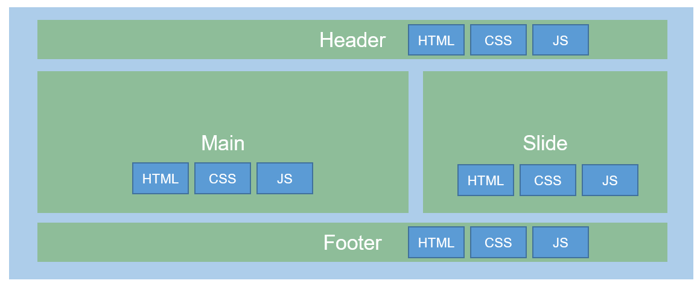
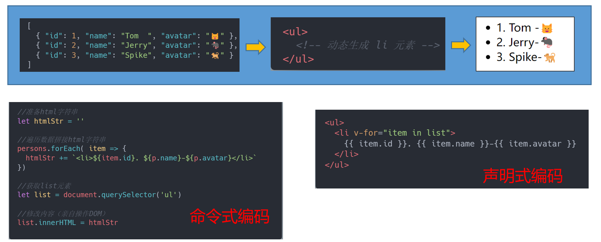

# Vue 基础第一天

---


## 今日目标

 

- ⭐ 能够说出 Vue 是什么
- ⭐ 能够熟练 Vue 模板语法的使用 
- ⭐ 能够说出什么是 MVVM


## 课程介绍


Vue 全家桶：Vue、Vue-cli 脚手架、Vue-Router、Vuex


## 1. Vue 简介

> 🎯 目标：能够说出什么是 Vue、知道 Vue 的作者以及特点

### 什么是 Vue

​							


Vue 是一套**`构建用户界面`**的**`渐进式`** JavaScript 框架。 


1. 构建用户界面：将数据渲染到页面

   

2. 渐进式：指 Vue 可以自顶向上的逐层应用，

   - 你可以在一个页面中去使用 Vue.js 这个库
   - 如果你需要使用路由，可以使用 Vue-router 官方库
   - 如果你需要使用状态管理库，可以使用 Vuex 官方库
   - 如果你需要构建大型复杂的单页面应用，可以使用官方提供的 Vue-cli 脚手架


### Vue 作者是谁


**`尤雨溪`**

独立开源开发者

前端框架 Vue.js 作者

前端构建工具 Vite 的作者


### Vue 发展史


###  Vue 特点


**知识点：**

1. 采用 **`组件化`**  的编程思想，将 UI 拆分为 独立、可复用、可组合 的代码片段，提高了项目代码的可维护性。
2. 利用简洁的语法进行 **`声明式`** 编码，无需直接操作 DOM ，提高了开发的效率
3. 超快 **`虚拟 DOM`** 和 优秀的 **`Diff 算法`**，最省心的优化，最大限度的复用 DOM 节点


**图示讲解：**

1. 采用 **`组件化`**  的编程思想，将 UI 拆分为 独立、可复用、可组合 的代码片段，提高了项目代码的可维护性。

   

   

2. **`声明式`** 编码

   

   
   
   
   
3. 超快 **`虚拟 DOM`** 和 优秀的 **`Diff 算法`**


**总结：**


1. Vue 是什么 ？
2. Vue 有什么特点 ？


## 2. Vue 开发环境搭建 

> 🎯 目标：能够做到自行搭建 Vue 开发环境

官方给提供的 Vue.js 分为 `开发版本(vue.js)`、`生产版本(vue.min.js)`, 学习和开发中我们使用 `开发版本(vue.js)`，因为会提供很多警告来帮你对付常见的错误与陷阱


1. 第一步：从 [Vue 官网](https://v2.cn.vuejs.org/v2/guide/installation.html) 下载依赖包

   

2. 第二步：在`html`文件中引入`vue.js`，在引入以后，全部会多一个 Vue 构造函数

   ```html
   <!-- 引入Vue -->
   <script type="text/javascript" src="../js/vue.js"></script>
   ```

   

3. 第三步：编写脚本关闭生产提示

   ```js
   // 阻止 vue 在启动时生成生产提示
   Vue.config.productionTip = false
   ```

   

4. 第四步：安装开发者工具：打开浏览器的【插件管理】，直接拖动`.crx`文件到浏览器即可

   

5. 第五步：配置页签图标：直接复制`favicon.ico`到根目录即可

   

> 🔔 测试是否配置成功，输出Vue构造函数：`console.log(Vue)`


## 3. Vue 之 Hello World

> 🎯 目标：熟练掌握该案例，以及 Vue 运行的流程步骤

**案例效果：**


**落地代码：**

```html
<!DOCTYPE html>
<html lang="en">

<head>
  <meta charset="UTF-8">
  <meta http-equiv="X-UA-Compatible" content="IE=edge">
  <meta name="viewport" content="width=device-width, initial-scale=1.0">
  <title>Document</title>
</head>

<body>
  <!-- 2. 创建页面容器 -->
  <div id="app">
    <h1>Hello, {{ name }}</h1>
  </div>

  <!-- 1. 需要先把 Vue 进行导入 -->
  <script src="../vue.js"></script>
  <script>
    Vue.config.productionTip = false

    // 3. 在导入 Vue 文件以后，全局就多了一个 Vue 构造函数，构造函数接收配置项作为参数
    new Vue({
      // 元素的挂载位置，即 Vue 接管的区域，哪块区域是 Vue 来进行解析
      // 一般是 css 选择器，也可以是 DOM 对象，document.querySelector('#app')
      el: '#app',
      // data 选项用来配置数据，即数据源，用来声明在页面上使用的数据
      data: {
        name: '尚硅谷'
      }
    })
  </script>
</body>

</html>
```


**总结：**

1.  想让Vue工作，就要创建一个 <font color="red">**Vue实例**</font>，且必须传入一个配置对象。
2.  `.app`容器中的代码，依然符合`HTML`规范，只是混入了一些特殊的`Vue`语法。
3.  `.app`容器中的代码：`HTML代码` ＋ `特殊的Vue语法`，组成了 **`Vue模板`**
4.  **`el 配置`**：用于指定当前Vue实例服务于哪个容器，值为：css选择器字符串。
5.  **`data 配置`**：用于存储数据，值暂时写成一个对象（以后还会写成函数）。


## 4. Vue 之 Hello World 分析

> 🎯 目标：熟练掌握该案例，以及 Vue 运行的流程步骤

1.  **注意事项 1： Vue 实例和容器是一一对应的关系，真实开发中一定只有一个Vue实例，**否则，渲染不成功，如图：一个实例对应对个容器，就会导致下面的一行元素渲染不成功

   

   ​					

   

2. **注意事项 2：**没有被 el 接管、管理的区域，Vue 不会进行解析和处理

3. **注意事项 3：数据驱动视图更新：数据改变，视图就会发生改变**

    

   


##  5. Vue 插值表达式的注意事项

> 🎯 目标：牢记插值表达式中的注意事项


**注意事项 ： 插值表达式  `{{  }}` 用于数据绑定，里面只能写 js 表达式，不能写语句**

 

```js

1.表达式：会产生一个值，可以放在任何一个需要值的地方：
    (1). 1
    (2). a
    (3). x > = 18 ? '成年' : '未成年'
    (4). 200 - 2
    (5). arr.map()

    等等....

2.语句（代码）: 不会产生值，只是控制代码走向：
    (1). if ( ) {}
    (2). for ( ) {}
    (3). try {} catch (err) {}
    等等....

```


## 6. Vue 模板语法 以及 v-bind

> 🎯 目标：理解什么是指令，并熟练 v-bind 指令的使用


Vue的模板语法分为**两大类**：

1.  插值
2.  指令


**指令的概念：**

1. 什么是指令：指令是 Vue 提供的一种特殊的属性，Vue 中指令全部以 **`v-`** 开头，例如：v-bind、v-model
2. 指令的值：预期是**单个 JavaScript 表达式** (v-for 除外，后面讲)
3. 指令的作用：用于解析标签（标签属性、标签体、绑定事件......）
4. 指令的职责：当表达式的值改变后，将最新的值响应式地作用于 DOM


**案例效果：**


**v-bind 指令**

1. **v-bind 常用于绑定标签属性**
2. v-bind 简写用法是一个冒号 **`:`**
3. 只有v-bind指令才能简写为 **`:`**别的指令不行，其他的指令有其他的简写形式、但并不是所有的指令都有简写形式


**落地代码：**

```html
<!DOCTYPE html>
<html lang="en">

<head>
  <meta charset="UTF-8">
  <meta http-equiv="X-UA-Compatible" content="IE=edge">
  <meta name="viewport" content="width=device-width, initial-scale=1.0">
  <title>搭建 Vue 开发环境</title>
</head>

<body>

  <div id="app">
    <h3>指令语法</h3>
    <!-- 指令：Vue 提供的特殊的属性，用于解析标签(标签属性、标签内容、绑定事件等) -->
    <!-- v-bind 常用于绑定标签属性 -->
    <p><a v-bind:href="url">百度一下，你就知道</a></p>
      
    <!-- v-bind 简写用法是一个冒号 : -->
    <!-- 只有v-bind指令才能简写为 :  别的指令不行 -->
    <!-- 其他的指令有其他的简写形式、但并不是所有的指令都有简写形式 -->
    <p><a :href="url">百度一下，你就知道</a></p>
  </div>

  <script src="../vue.js"></script>
  <script>
    Vue.config.productionTip = false

    new Vue({
      el: '#app',
      data: {
        url: 'https://www.baidu.com'
      }
    })
  </script>
</body>

</html>
```


## 7. Vue 双向数据绑定 v-model

> 🎯 目标：
>
> 1. 理解什么是单向数据绑定以及什么是双向数据绑定
> 2. 熟练掌握 v-model 的使用以及注意事项

**案例效果：**


**v-model 指令：**

1. v-model 指令常用语在表单控件或者组件上创建 **`双向绑定`**


**单向数据绑定和双向数据绑定：**

Vue中有两种绑定数据的方式：

1. 单向数据绑定（`v-bind`）：数据只能从data流向页面。
2. 双向数据绑定（`v-model`）：数据不仅能从data流向页面，也能从页面流向data。


**v-model 使用注意点**：

> 1. `v-model`目前只能用在输入类（表单类）元素上。（以后还能用写在组件标签上）。
> 2. `v-model`默认收集的是`value`值，所以`v-model:value="xxx"` 可以简写为 `v-model="xxx"`。


**落地代码**

```html
<!DOCTYPE html>
<html lang="en">

<head>
  <meta charset="UTF-8">
  <meta http-equiv="X-UA-Compatible" content="IE=edge">
  <meta name="viewport" content="width=device-width, initial-scale=1.0">
  <title>搭建 Vue 开发环境</title>
</head>

<body>

  <div id="app">
    <!-- 单向数据绑定：数据只能从 data 流向页面，不能从页面流向 data -->
    单向数据绑定（v-bind）： &nbsp;&nbsp;<input type="text" :value="name"> <br>

    <!-- 双向数据绑定：数据不仅能从 data 流向页面，也能从页面流向 data -->
    双向数据绑定（v-model）：<input type="text" v-model:value="name"> <br>

    <!-- 注意：v-model 只能应用在表单元素上 -->
    <!-- <p v-model="name"></p> -->

    <!-- 注意：v-model 默认只能收集元素的 value 值，因此 v-model:value="xxx" 可以直接简写成 v-mode="xxx" -->
    <select name="hero" v-model:value="hero">
      <option value="亚瑟">亚瑟</option>
      <option value="妲己">妲己</option>
      <option value="安琪拉">安琪拉</option>
    </select>
  </div>

  <script src="../vue.js"></script>
  <script>
    Vue.config.productionTip = false

    new Vue({
      el: '#app',
      data: {
        name: '尚硅谷',
        hero: '亚瑟'
      }
    })
  </script>
</body>

</html>
```


## 8. Vue 之 MVVM 模型

> 🎯 目标：能够说出什么是 MVVM

​                               


MVVM 是软件架构设计模式，简化用户界面事件驱动编程的方式，其中：


1. `M`：模型(`Model`) ：data中的数据。
2. `V`：视图(`View`) ：模板。
3. `VM`：视图模型(`ViewModel`) ： Vue实例对象。


在 MVVM 架构中，不允许数据和视图直接通信的，想要通信只能通过 ViewModel 来通信，可以理解：ViewModel 是连接 View 和 Model 的中间件、桥梁。Vue 虽然没有完全遵循 MVVM 模型，但是 Vue 的设计也受到了它的启发。因此在文档中经常会使用 `vm` (ViewModel 的缩写) 这个变量名表示 Vue 实例。


```vue
<script>
  const vm = new Vue({
    el: '#app'
  })
  
  console.log(vm)
</script>
```


## 9. vm 实例身上的属性和方法

 

1. `vm`身上有很多`$`开头的属性或方法，这是给我们程序员用的（也不都用）。
2. `vm`身上也有以`_`开头的属性或方法，这些是 Vue 内部使用的，开发中不要使用。
3. `data`中所配置的属性，也不知道怎么了（后面会详细说），最终都出现在了`vm`身上。
4. `vm`身上所有的属性，以及顺着`vm`能找到的东西，都可以在模板中直接使用。但往往我们使用的只是那些`data`中配置的数据。


## 10. Vue 实例配置项 el 三种写法


1. 第一种写法：值为`css`选择器字符串

   ```js
   new Vue({
     el:'#demo'
     //******
   })
   ```

   

2. 第二种写法：值为一个真实`DOM`元素 —— 几乎不用，了解即可。

   ```js
   new Vue({
     el:document.getElementById('demo'),
     //******
   })
   ```

   

3. 第三种写法：使用`$mount`方法去替代`el`配置。

   ```js
   new Vue(/******/).$mount('#demo')
   ```


## 11. Vue 实例配置项 data 两种写法


**data 的两种写法：**

1. 第一种（对象式）

   ```js
   data:{
     school:'尚硅谷'
   }
   ```

   

2. 第二种（函数式）—— 最近不用，以后会用。

   ```js
   data(){
     return {
       school:'尚硅谷'
     }
   }
   ```


**两种写法如何选择 ?： **

目前哪种写法都可以，以后学习到组件时，data 必须使用函数式，否则会报错。


**注意事项：**

由 Vue 提供的函数 (现阶段我们只学了个 data 函数，别的没学呢)，一定不要写箭头函数，一旦写了箭头函数，this 就不再是 Vue 实例了。


## 12. 复习 Object.defineProperty

> 🎯 目标：回顾 Object.defineProperty，做到熟练掌握


**Object.defineProperty 作用是什么**

**`Object.defineProperty()`** 方法会直接在一个对象上定义一个新属性，或者修改一个对象的现有属性，并返回此对象。


**语法：**

```js
// obj： 要定义属性的对象
// prop：要定义或修改的属性的名称
// descriptor：要定义或修改的属性描述符
Object.defineProperty(obj, prop, descriptor)

```


**落地代码：**

1. 普通对象也可以直接定义一个新属性或者直接修改一个对象的现有属性，例如：

   ```js
   let obj = {
     name: 'Tom',
     gender: '男' 
   }
   
   // 新增一个属性
   obj['age'] = 10
   
   // 修改一个属性
   obj['name'] = 'jerry'
   
   // 删除一个属性
   delete obj['age']
   ```

   

2.  如果想对属性进行“高级定制”，除了能够追加属性以后，我们要求不能够对对象属性执行删除、遍历、修改的操作

   ```js
   let obj = {
     name: 'Tom',
     gender: '男'
   }
   
   // 第一个参数：指定的对象，即对哪一个对象进行新增、修改操作
   // 第二个参数：需要新增和修改的属性
   // 第三个参数：是一个对象，里面有要修改的、要新增的属性的属性描述符
   Object.defineProperty(obj, 'age', {
     value: 18, // 要修改或添加属性的值，注意：这样添加以后该对象不可枚举、删除
     enumerable: true, // 设置属性是否可枚举，默认是 false
     configurable: true, // 设置属性是否可删除，默认是 false
     writable: true // 设置属性是否可被修改，默认是 false
   })
   
   // for (const key in obj) {
   //   console.log(obj[key])
   // }
   
   obj['age'] = 1000
   
   // delete obj['age']
   
   console.log(obj)
   ```

   

3. `Object.defineProperty`的`get`与`set`配置：

   ```js
   //定义一个number变量
   let number = 18
   
   //定义一个对象
   let person = {
     name: 'Tom',
     gender: '男'
   }
   
   //借助 Object.defineProperty 去追加 age 属性
   Object.defineProperty(person,'age',{
     enumerable:true,
     //get 函数（getter）何时执行？—— 有人读取 person 对象的 age 属性时执行
     //get 函数（getter）中的this是谁？ —— 当前对象（person）
     get(){
       console.log('getter执行了',this)
       return number
     },
     // set函数（setter）何时会被调用？ —— 有人修改 person 对象的 age 属性时执行
     // set函数（setter）中的 this 是谁？ —— 当前对象（person）
     set(value){
       console.log('有人修改了person的age属性，值为：',value,this)
       number = value
     }
   })
   ```

   


## 13. 数据代理

> 🎯 目标：能够了解数据代理的概念并说出 Vue 数据代理的原理

### 何为数据代理？


通过一个对象代理对另一个对象中属性的操作（读/写）。

```js
// 通过一个对象(a) 代理 对另一个对象(b) 中属性 (age) 的操作（读/写）

let a = { num: 10 }
let b = { age: 100 }

Object.defineProperty(a, 'age', {
  get () {
    return b.age
  },

  set (newVal) {
    b.age = newVal
  }
})
```


###  Vue中的数据代理


**知识点：**

- 前情提要：我们`new Vue(options)`时传入的那个`data`，被`Vue`放在了`vm`上，名为`_data`。

- Vue中的数据代理：通过`vm`来对`_data`中属性的操作（读/写）。

- Vue中数据代理的好处：模板中可以更加方便的操作`_data`中的数据，例如：

  > 若无数据代理，这么写：`{{_data.name}}` —— 很麻烦。
  >
  > 若有数据代理，这么写：`{{name}}` —— 香！
  >
  > 注意：此时我们先不关注`_data`中为什么也有`getter`、`setter`，过几天就会说。


**落地代码：**

```html
<!DOCTYPE html>
<html lang="en">

<head>
  <meta charset="UTF-8">
  <meta http-equiv="X-UA-Compatible" content="IE=edge">
  <meta name="viewport" content="width=device-width, initial-scale=1.0">
  <title>搭建 Vue 开发环境</title>
</head>

<body>

  <div id="app">
    <p>动画名称：{{ animation }}</p>
    <p>主角名称：{{ name }}</p>

    <p>{{ _data.animation }}</p>
    <p>{{ _data.name }}</p>
  </div>

  <script src="../vue.js"></script>
  <script>
    Vue.config.productionTip = false

    // 前情提要：
    // new Vue(options) 以后，data 中的数据会被 Vue 收集到 vm 中的 _data 属性上

    // Vue 中的数据代理：通过 【vm对象】 代理 【_data】 中的属性进行操作(读/写)

    // Vue 数据代理的好处：
    // 没有数据代理：在 Vue模板中通过 _data 访问数据，繁琐 {{ _data.animation }}
    // 有数据代理：在 Vue 模板中直接使用数据 即可 {{ animation }}

    const vm = new Vue({
      el: '#app',
      data: {
        animation: '猫和老鼠',
        name: 'Tom'
      }
    })

    console.log(vm)
  </script>
</body>

</html>
```


###  数据代理的原理

1. 遍历`_data`对象中所有的属性，通过`Object.defineProperty()`一个一个都添加到`vm`上。
2. 随后`vm`上就拥有了`_data`中所有的属性，且都有自己的`getter`、`setter`。
3. `getter`、`setter`内部操作（读/写）的是`_data`中对应的属性。


## 拓展阅读(课程不讲解)

```html
<!DOCTYPE html>
<html lang="en">

<head>
  <meta charset="UTF-8">
  <meta http-equiv="X-UA-Compatible" content="IE=edge">
  <meta name="viewport" content="width=device-width, initial-scale=1.0">
  <title>Document</title>
</head>

<body>

  <script>

    // ------------------------------------------------------
    // ----------------  以下代码为数据代理 -------------------
    // ------------------------------------------------------

    // 创建 Vue 构造函数，options 是用户传递的配置项
    function Vue(options) {
        
      this._data = options.data || {}
      
      // 该方法的作用：将 data 中的成员转换成 getter 和 setter，并注入到 Vue 实例中
      this._proxyData(this._data)
    }

    // 将 data 中的数据转换成 getter 和 setter 注入到 vue 实例 vm 身上
    Vue.prototype._proxyData = function (_data) {
      // 遍历 data 中的所有的属性，将 data 中每个属性，都放到 vm 上
      Object.keys(_data).forEach(key => {
        // 把 data 中的数据都注入到实例中
        Object.defineProperty(this, key, {
          enumerable: true,
          configurable: true,
          get() {
            return _data[key]
          },
          set(newValue) {
            if (newValue === _data[key]) return
            _data[key] = newValue
          }
        })
      })
    }


    const vm = new Vue({
      data: {
        name: '亚瑟',
        age: 10
      }
    })

    console.log(vm)
  </script>
</body>

</html>
```


