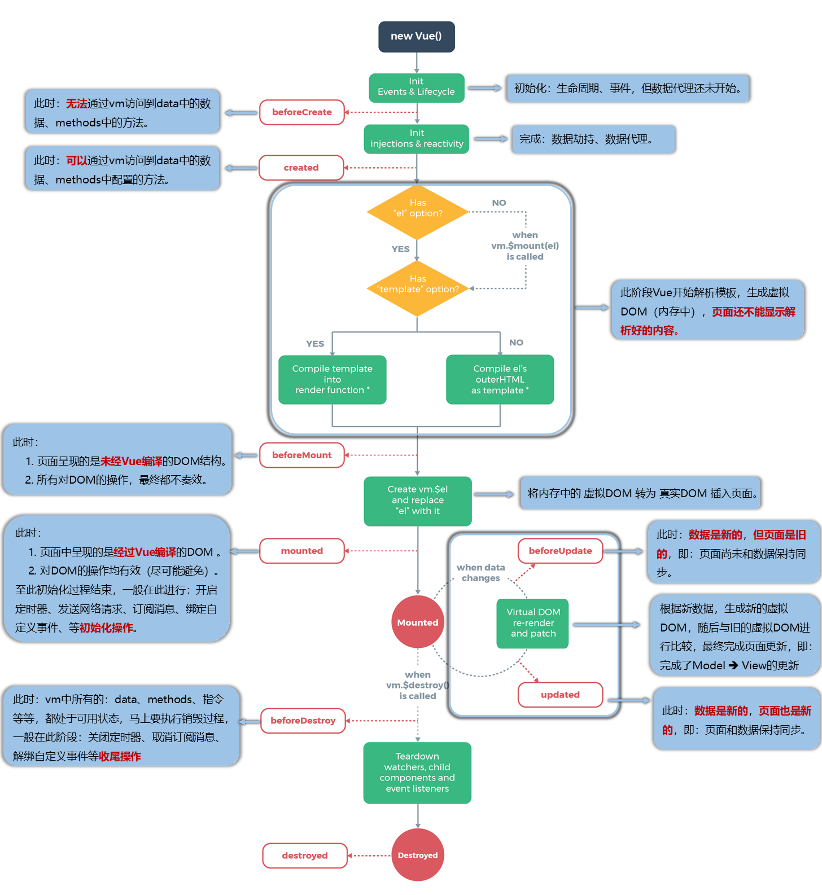

# Vue 第四天笔记

##  1 列表渲染-v-for

> 🎯 目标：熟练掌握 v-for 的使用

###  1.1 v-for 基本使用


**知识点：**

1. 指令：`v-for`。
2. 作用：用于遍历数据，生成多个结构。
3. 语法：`v-for="item in xxx" :key="????"`。

> 通俗理解：想生成多个谁，就在谁身上加`v-for`，别忘了写`key`。
>
> `key`的使用原则（同`react`）：有唯一值就用唯一值（身份证号、手机号、学号......），没有就用索引值。


**落地代码：**

```html
<!DOCTYPE html>
<html lang="en">

<head>
  <meta charset="UTF-8">
  <meta http-equiv="X-UA-Compatible" content="IE=edge">
  <meta name="viewport" content="width=device-width, initial-scale=1.0">
  <title>搭建 Vue 开发环境</title>
</head>

<body>

  <div id="app">
    <h2>人员列表（v-for遍历数组，贼常用！！）</h2>

    <ul>
      <li v-for="(item,index) in animals" :key="item.id">
        {{ item.name }} - {{ item.age }} - {{ index }}
      </li>
    </ul>
  </div>

  <script src="../vue.js"></script>
  <script>
    Vue.config.productionTip = false

    const vm = new Vue({
      el: '#app',
      data: {
        animals: [
          { id: 1, name: 'Tom', age: 3 },
          { id: 2, name: 'Jerry', age: 4 },
          { id: 3, name: 'Spike', age: 5 }
        ]
      }
    })
  </script>
</body>

</html>
```


###  1.2 深入探讨 v-for


**知识点**

1. 遍历数组

   ```html
   <ul>
     <li v-for="(item,index) in arr" :key="index"> {{item}} </li>
   </ul>
   ```

2. 遍历对象

   ```html
   <li v-for="(value,key,index) in car" :key="index"> 
     {{value}} - {{key}} - {{index}}
   </li>
   ```

3. 遍历字符串

   ```html
   <li v-for="(char,index) in str" :key="index"> 
     {{char}} - {{index}} 
   </li>
   ```

4. 遍历指定次数

   ```html
   <li v-for="(number,index) in 10" :key="index"> 
     {{number}} - {{index}}
   </li>
   ```

5. `v-for`很健壮，遍历如下内容都不会报错

   ```html
   <h1 v-for="(a,b) in null">尚硅谷</h1>
   <h1 v-for="(a,b) in undefined">尚硅谷</h1>
   <h1 v-for="(a,b) in '' ">尚硅谷</h1>
   <h1 v-for="(a,b) in true ">尚硅谷</h1>
   ```


**落地代码**

```html
<!DOCTYPE html>
<html lang="en">

<head>
  <meta charset="UTF-8">
  <meta http-equiv="X-UA-Compatible" content="IE=edge">
  <meta name="viewport" content="width=device-width, initial-scale=1.0">
  <title>v-for 其他使用场景</title>
</head>

<body>

  <div id="app">
    <h2>v-for 遍历对象</h2>
    <ul>
      <li v-for="(value, key, index) in hero">
        {{value}} - {{key}} - {{index}}
      </li>
    </ul>

    <hr>

    <h2>v-for遍历字符串</h2>
    <ul>
      <li v-for="(char, index) in msg">
        {{char}} - {{index}}
      </li>
    </ul>

    <h2>遍历指定次数</h2>
    <ul>
      <li v-for="(number, index) in 10">
        {{number}} - {{index}}
      </li>
    </ul>

    <!-- v-for比较健壮，如下代码，不会报错 -->
    <div v-for="item in undefined">{{ item }}</div>
    <div v-for="item in null">{{ item }}</div>
    <div v-for="item in true">{{ item }}</div>
  </div>

  <script src="../vue.js"></script>
  <script>
    Vue.config.productionTip = false

    const vm = new Vue({
      el: '#app',
      data: {
        hero: {
          name: '亚瑟',
          price: '10'
        },
        msg: 'Hello, World'
      }
    })
  </script>
</body>

</html>
```


### 1.4 Key 的原理


1. 虚拟DOM中key的作用：
   - key是虚拟DOM对象的标识，当数据发生变化时，Vue会根据【新数据】生成【新的虚拟DOM】,
   - 随后Vue进行【新虚拟DOM】与【旧虚拟DOM】的差异比较，比较规则如下：

​     

2. 对比规则：
   - 旧虚拟DOM中找到了与新虚拟DOM相同的key：
     - 若虚拟DOM中内容没变, 直接使用之前的真实DOM！
     - 若虚拟DOM中内容变了, 则生成新的真实DOM，随后替换掉页面中之前的真实DOM。
   - 旧虚拟DOM中未找到与新虚拟DOM相同的key
     - 创建新的真实DOM，随后渲染到到页面


3. 用index作为key可能会引发的问题：
   - 若对数据进行：逆序添加、逆序删除等破坏顺序操作:
     - 会产生没有必要的真实DOM更新 ==> 界面效果没问题, 但效率低。
   - 如果结构中还包含输入类的DOM：
     - 会产生错误DOM更新 ==> 不仅效率低、且界面效果都是有问题。


4. 开发中如何选择key ？
   - 最好使用每条数据的唯一标识作为key, 比如id、手机号、身份证号、学号等唯一值。
   - 如果不存在对数据的逆序添加、逆序删除等破坏顺序操作，仅用于渲染列表用于展示，使用index作为key是没有问题的。


**落地代码：**

```html
<!DOCTYPE html>
<html>

<head>
  <meta http-equiv="X-UA-Compatible" content="IE=edge">
  <meta name="viewport" content="width=device-width, initial-scale=1.0">
  <title>3.key作用</title>
    
  <!-- 引入Vue -->
  <script src="../vue.js"></script>
</head>

<body>
  <!-- 准备好一个容器-->
  <div id="app">
    <h2>🐱和🐀</h2>
      
    <button @click="addAnimal">添加一个可爱的狗狗</button>
      
    <ul>
      <li v-for="(item,index) in animals" :key="index">
        <span>{{ item.name }}-{{ item.age}}</span>
        <input type="text">
      </li>
    </ul>
  </div>

</body>

<script type="text/javascript">
  //阻止 vue 在启动时生成生产提示。
  Vue.config.productionTip = false

  new Vue({
    el: '#app',
    data: {
      // 初始化数据
      animals: [
        { id: 1, name: 'Tom', age: 3 },
        { id: 2, name: 'Jerry', age: 4 },
        { id: 3, name: 'Spike', age: 5 }
      ]
    },
    methods: {
      addAnimal() {
        const liu = { id: '004', name: 'Tyke', age: 2 }
        this.animals.unshift(liu)
      }
    }
  })
</script>

</html>
```


###  1.3 列表过滤案例 - watch 写法


```html
<!DOCTYPE html>
<html lang="en">

<head>
  <meta charset="UTF-8">
  <meta http-equiv="X-UA-Compatible" content="IE=edge">
  <meta name="viewport" content="width=device-width, initial-scale=1.0">
  <title>搭建 Vue 开发环境</title>
</head>

<body>

  <div id="app">
    <h2>人员列表</h2>
    <input type="text" v-model="keyWord">
    <ul>
      <li v-for="p in persons2" :key="p.id">
        {{p.name}} - {{p.age}} - {{p.gender}}
      </li>
    </ul>
  </div>

  <script src="../vue.js"></script>
  <script>
    Vue.config.productionTip = false

    const vm = new Vue({
      el: '#app',
      data: {
        keyWord: '',
        persons: [
          { id: '001', name: '马冬梅', age: 19, gender: '女' },
          { id: '002', name: '周冬雨', age: 20, gender: '女' },
          { id: '003', name: '周杰伦', age: 21, gender: '男' },
          { id: '004', name: '帅邓伦', age: 22, gender: '男' },
        ],
        persons2: []
      },
      watch: {
        keyWord: {
          immediate: true,
          handler(val) {
            // console.log('关键词变了，我要拿着一堆人，去匹配出符合的人',val)
            const fltPersons = this.persons.filter((person) => {
              console.log(person.name.indexOf(val))
              return person.name.indexOf(val) !== -1
            })
            console.log(fltPersons)
            this.persons2 = fltPersons
          }
        }
      }
    })
  </script>
</body>

</html>
```


###  1.4 列表过滤案例 - computed 写法


**落地代码**

```html
<!DOCTYPE html>
<html lang="en">

<head>
  <meta charset="UTF-8">
  <meta http-equiv="X-UA-Compatible" content="IE=edge">
  <meta name="viewport" content="width=device-width, initial-scale=1.0">
  <title>搭建 Vue 开发环境</title>
</head>

<body>

  <div id="app">
    <h2>人员列表</h2>
    <input type="text" v-model="keyWord">
    <ul>
      <li v-for="p in persons2" :key="p.id">
        {{p.name}} - {{p.age}} - {{p.gender}}
      </li>
    </ul>
  </div>

  <script src="../vue.js"></script>
  <script>
    Vue.config.productionTip = false

    const vm = new Vue({
      el: '#app',
      data: {
        keyWord: '',
        persons: [
          { id: '001', name: '马冬梅', age: 19, gender: '女' },
          { id: '002', name: '周冬雨', age: 20, gender: '女' },
          { id: '003', name: '周杰伦', age: 21, gender: '男' },
          { id: '004', name: '帅邓伦', age: 22, gender: '男' },
        ]
      },
      computed: {
        persons2() {
          return this.persons.filter(person => person.name.indexOf(this.keyWord) !== -1)
        }
      }
    })
  </script>
</body>

</html>
```


## 2. Vue 其他指令和拓展

> 🎯 目标：了解 Vue 其他指令的使用

**已经学习过的指令**


1. `v-bind`		  ：单向数据绑定，可简写为 `:href="xxx"`
2. `v-model`		：双向数据绑定，只能用于表单类元素
3. `v-for`			 ：遍历数组 / 对象 / 字符串 / 指令次数
4. `v-on`				：绑定事件监听，可简写为 @
5. `v-if`				：条件渲染（动态控制节点是否存在）
6. `v-else-if`  ：条件渲染（动态控制节点是否存在）
7. `v-else`		  ：条件渲染（动态控制节点是否存在）
8. `v-show`		  ：条件渲染（动态控制节点是否存在）


**其他指令：**


1. `v-text`			：解析文本内容，作用类似于插值表达式，会将标签已有内容全部覆盖
2. `v-html`			：解析内容和包含 HTML 标签的字符串渲染为页面的 HTML 元素，**`慎用`**，会覆盖标签已有内容
3. `v-once`			：只渲染元素和组件**一次**。随后的重新渲染都会被跳过
4. `v-pre`			  ：原样展示，不进行任何解析，即跳过这个元素和它的子元素的解析过程
5. `v-cloak`		 ：保持在元素上直到关联实例结束编译，和 CSS 规则如 `[v-cloak] { display: none }` 一
                                 起起用时，这个指令可以隐藏未编译的 Mustache 标签直到实例准备完毕


**v-model 拓展**

1. `lazy`：失去焦点再收集数据。
2. `number`：输入字符串转为有效的数字。
3. `trim`：输入首尾空格过滤。


**落地代码：**

```html
<!DOCTYPE html>
<html lang="en">

<head>
  <meta charset="UTF-8">
  <meta http-equiv="X-UA-Compatible" content="IE=edge">
  <meta name="viewport" content="width=device-width, initial-scale=1.0">
  <title>搭建 Vue 开发环境</title>
  <style>
    [v-cloak] {
      display: none;
    }
  </style>
</head>

<body>

  <div id="app">
    <!-- v-text：渲染文本内容，会将数据解析到标签中间，会覆盖标签内容 -->
    <p v-text="text">我戒掉王者了~~~</p>

    <!-- 解析内容和包含 HTML 标签的字符串渲染为页面的 HTML 元素，慎用，会覆盖标签已有内容 -->
    <p v-html="html"></p>

    <!-- 只渲染元素和组件一次。随后的重新渲染都会被跳过 -->
    <p v-once>
      <span>{{ one }}</span> <button @click="one = '我只解析一次，是真的'">更改 one</button>
    </p>

    <!-- 原样展示，不进行任何解析，即跳过这个元素和它的子元素的解析过程 -->
    <div v-pre>
      <hr />
      <span>我被 v-pre 包裹，我会跳过解析</span>
      <span>{{ text }}</span>
      <hr />
    </div>

    <!--
      v-cloak ：保持在元素上直到关联实例结束编译，和 CSS 规则如 [v-cloak] { display: none } 一起用时
      这个指令可以隐藏未编译的 Mustache 标签直到实例准备完毕
    -->
    <p v-cloak>
      {{ loadText }}
    </p>
    <button @click="getData">数据正在请求中...</button>
  </div>

  <script src="../vue.js"></script>
  <script>
    Vue.config.productionTip = false

    const vm = new Vue({
      el: '#app',
      data: {
        text: '不许戒，走，带你一起到峡谷遨游~~',
        html: '<a href="https://pvp.qq.com/">一起到峡谷遨游~~</a>',
        one: '我只被解析一次',
        loadText: ''
      },
      mounted() {
        setInterval(() => {
          this.loadText = '我是数据，我返回了~~~'
        })
      }
    })
  </script>
</body>

</html>
```


```html
<!DOCTYPE html>
<html lang="en">

<head>
  <meta charset="UTF-8">
  <meta http-equiv="X-UA-Compatible" content="IE=edge">
  <meta name="viewport" content="width=device-width, initial-scale=1.0">
  <title>搭建 Vue 开发环境</title>
</head>

<body>

  <div id="app">
    <!-- lazy：失去焦点再收集数据。 -->
    <input type="text" v-model.lazy="val">
    <textarea cols="30" rows="10" v-model.lazy="val"></textarea>

    <!-- number：输入字符串转为有效的数字，一般需要配合 number 使用 -->
    <input type="number" v-model.number="val">

    <!-- trim：输入首尾空格过滤 -->
    <input type="number" v-model.number="val">
  </div>

  <script src="../vue.js"></script>
  <script>
    Vue.config.productionTip = false

    const vm = new Vue({
      el: '#app',
      data: {
        val: ''
      }
    })
  </script>
</body>

</html>
```


## 3. Vue 自定义指令(了解)

> 🎯 目标：了解 Vue 其他指令的使用

**知识点：**

在实际开发中，我们可以使用 Vue 提供的指令实现高效的开发，但如果我们想实现某个特殊的需求，Vue 提供的指令满足不了我们的需求，这时候就需要我们自定义指令的方式来进行实现，Vue 也允许注册自定义指令。


注意：在 Vue 中，核心的思想是：数据驱动视图，然而，有的情况下，你仍然需要对普通 DOM 元素进行底层操作，这时候就会用到自定义指令。


综上所述：`自定义指令的场景适用于 Vue 提供的指令满足不了我们的需求，但是又需要进行 DOM 进行操作时`


**语法：**

```js
new Vue({
  el: '#app',
  directives: {
    '指定名称': {
      // bind: 当自定义指令在元素中使用的时候触发
      // el: 使用了指令的那个元素
      // binding: 使用了指令的那个元素身上的属性
      bind: function (el, binding) {
        el.focus()
      }
    }
  }
})
```


**注意事项：**

在创建指令的时候，指令名不用加上 `v-`，在使用的时候必须加上 `v-`


**落地代码：**

**案例 1：**

```html
<!DOCTYPE html>
<html lang="en">

<head>
  <meta charset="UTF-8">
  <meta http-equiv="X-UA-Compatible" content="IE=edge">
  <meta name="viewport" content="width=device-width, initial-scale=1.0">
  <title>自定义指令</title>
</head>

<body>

  <div id="app">
    值是：<span>{{ 10 }}</span> <br />
    值放大 10 倍数：<span v-text="10 * 10"></span><br />
    值放大 10 倍数：<span v-big="10 * 10"></span><br />
  </div>

  <script src="../vue.js"></script>
  <script>
    Vue.config.productionTip = false

    const vm = new Vue({
      el: '#app',
      directives: {
        // 属性名为 自定义指令 名，在声明的时候不需要加 v-
        big: {
          bind(el, binding) {
            el.innerHTML = binding.value
          }
        }
      }
    })
  </script>
</body>

</html>
```


**案例 2： 权限案例**

```html
<!DOCTYPE html>
<html lang="en">

<head>
  <meta charset="UTF-8">
  <meta http-equiv="X-UA-Compatible" content="IE=edge">
  <meta name="viewport" content="width=device-width, initial-scale=1.0">
  <title>自定义指令</title>
</head>

<body>

  <div id="app">
    <!-- 业务需求：如果数据在 arr 里，则显示对应的按钮，否则把按钮隐藏 -->
    <button v-showbtn="'add'">新增</button>
    <button v-showbtn="'edit'">编辑</button>
    <button v-showbtn="'del'">删除</button>
  </div>

  <script src="../vue.js"></script>
  <script>
    Vue.config.productionTip = false

    const vm = new Vue({
      el: '#app',
      data: {},
      directives:{
        // 属性名为 自定义指令 名，在声明的时候不需要加 v-
        showbtn: {
          bind(el, binding) {
            // 模拟后端返回的数据
            const permissonList = ['add', 'edit', 'del']

            // 判断后端返回的数据中是否包含
            const isShowBtn = permissonList.includes(binding.value)

            if (!isShowBtn) {
              // 先获取父级，由父级删除自己
              el.parentNode.removeChild(el)
            }
          }
        }
      }
    })
  </script>
</body>

</html>
```


## 4. Vue 过滤器(了解) 

> 🎯 目标：了解 Vue 过滤器的使用

**知识点：**

Vue.js 允许你自定义过滤器，可被用于一些常见的文本格式化。过滤器可以用在两个地方：

1. **双花括号插值**
2. **`v-bind` 表达式** 

过滤器应该被添加在 JavaScript 表达式的尾部，由**`“管道”`**符号指示


**语法：**

```html
// 竖线 | ：称为管道运算符

<!-- 在双花括号中 -->
<div>{{ message | capitalize }}</div>

<!-- 在 `v-bind` 中 -->
<div v-bind:id="rawId | formatId"></div>
```


**落地代码：**

```html
<!DOCTYPE html>
<html lang="en">

<head>
  <meta charset="UTF-8">
  <meta http-equiv="X-UA-Compatible" content="IE=edge">
  <meta name="viewport" content="width=device-width, initial-scale=1.0">
  <title>自定义指令</title>
</head>

<body>

  <div id="app">
    <p>{{ info | format }}</p>
    <p v-bind:a="info | format"></p>
  </div>

  <script src="../vue.js"></script>
  <script>
    Vue.config.productionTip = false

    const vm = new Vue({
      el: '#app',
      data: {
        info: `i'm the best`
      },
      filters: {
        // format: 方法名：过滤器名称
        // 形参：是管道运算符前面的数据，也就是需要格式化的数据
        format (val) {
          // 内部必须有返回值
          return val.charAt(0).toUpperCase() + val.slice(1)
        }
      }
    })
  </script>
</body>

</html>
```


## 5. Vue 生命周期

> 🎯 目标：【必须】熟练掌握 Vue 生命周期执行的过程 ⭐⭐⭐⭐⭐


### 5.1 基础概念


**生命周期与生命周期函数**

1.  生命周期：通常是指一个事物从创建到最终消亡的整个过程
2.  Vue 的生命周期：就是指 Vue 的实例或者组件从创建-> 运行 -> 销毁的整个阶段
3.  生命周期函数：又称生命周期钩子，由框架提供的一系列内置函数，会伴随着组件的生命周期，按照顺序自动执行


**为什么要学习生命周期钩子函数**

1. 有利于帮助我们分析实例或者组件的运行流程、辅助程序员完成更复杂的功能、同时有助于分析代码中的错误原因
2. 生命周期钩子函数为开发人员在不同阶段操作组件提供了操作时机，例如：何时发起请求、何时进行 DOM 操作等


###  5.2 生命周期图示


**生命周期图**




**常用的钩子**

1. `beforeCreate：`整个生命周期中，最先执行的钩子，后面讲到【事件总线】的时候会用
2. `mounted：`（张三出生）: 发送`ajax`请求、启动定时器、绑定自定义事件、订阅消息等【初始化操作】
3. `beforeDestroy：`（张三即将死掉）: 清除定时器、解绑自定义事件、取消订阅消息等【收尾工作】


**关于销毁vm**

1. 所谓的销毁`vm`，并不是指让`vm` “从地球上消失”，而是：`vm`依然在，但是已不具备响应式的能力了。
2. 销毁后借助`Vue`开发者工具看不到任何信息。
3. 不要在`beforeDestroy`操作数据，因为即便操作数据，也不会再触发更新流程了。`beforeDestroy`中所有不修改数据的操作，都会得到响应。


> 🔔  注意：
>
> 1.  生命周期函数的名字不可更改 （图上红框标注的），生命周期中的具体逻辑，需要具体需求开发
> 2.  生命周期函数中的`this`指向是`vm`或 组件实例对象。


**落地代码**

```html
<!DOCTYPE html>
<html lang="en">

<head>
  <meta charset="UTF-8">
  <meta http-equiv="X-UA-Compatible" content="IE=edge">
  <meta name="viewport" content="width=device-width, initial-scale=1.0">
  <title>搭建 Vue 开发环境</title>
</head>

<body>

  <div id="app"></div>

  <script src="../vue.js"></script>
  <script>
    Vue.config.productionTip = false

    // new Vue 只有产生了 vm 实例
    const vm = new Vue({
      el: '#app',
      data: {
        num: 1
      },
      template: `
        <div>
          <h2>{{ num }}</h2>
          <button @click="add">+1</button> 
          <button @click="death">销毁 vm</button>
        </div>
      `,
      methods: {
        add() {
          console.log('我被执行啦')
          this.num += 1
        },

        death () {
          this.$destroy()
        }
      },
      // 钩子函数是一个个的函数，所以千万别写成配置项、对象
      beforeCreate () {
        // 开始初始化阶段，初始化生命周期、以及事件，
        // 在这个阶段数据代理还没有开始，也就是没有把数据代理带 vm 身上，
        // 所以不能访问 data 里面的数据和 methods 里面的方法
        // console.log(this)

        // 因为生命周期是自动执行、往下运行的，不会停留，所以直接打印 this 实际上是执行完整个生命周期后的内容
        // debugger
      },
      created () {
        // 初始化阶段完成，数据代理(把数据和方法代理给 vm)、数据劫持(实现数据响应式)
        // 所以在这个阶段能够通过 this 访问到 data 里面的数据，也可以调用 methods 里面的方法
        // console.log(this.num)
        // this.add()

        // debugger
      },
      beforeMount () {
        // 挂载之前：把编译好的 DOM 挂载到页面之前
        // 在 beforeMount 这个阶段，Vue 在进行模板解析，就是解析指令、解析插值表达式，从 data 里面取到数据进行赋值
        // 只不过这个阶段是在内存中工作的，在页面上还看不到
        // 页面中看到是还是编译好之前的页面结构
        // console.log(this)

        // 在这个阶段不要对 DOM 进行任何的操作，
        // 因为虚拟 DOM 最终会产生真正的 DOM，然后真正的 DOM 会挂载到页面上，
        // 如果这时候进行了 DOM 操作，最终会被产生的真正 DOM 给替换、覆盖掉
        // document.querySelector('h2').innerHTML = '亚瑟'

        // debugger
      },
      mounted () {
        // 挂载完毕：就是编译好后产生的真正的 DOM 渲染到页面
        // 这时候我们在浏览器上看到的就是编译好以后的内容，这时候就可以执行 DOM 相关的操作
        
        // debugger
      },
      beforeUpdate () {
        // 更新阶段：更新之前，也就是指数据变更新数据展示到页面之前
        // 在这个阶段，data 里面的数据是新的，但是页面上展示的数据还是旧的
        // console.log(this)

        // debugger
      },
      updated () {
        // 更新阶段：更新完成，更新后的数据已经同步到页面之上
        // 根据新的数据，产生新的虚拟 DOM，然后新的虚拟 DOM 和 旧的虚拟 DOM 进行 Diff 对象，找出差异
        // 最终完成页面的渲染，此时，更新后的数据就同步到了页面上
        // console.log(this)

        // debugger
      },
      beforeDestroy () {
        // 在 Vue 中执行销毁以后，vm 还是存在的，之前执行的操作都还存在，但是数据已经不具备响应式的能力 
        console.log('销毁之前')

        console.log(this.num)
        this.add()
      }
    })
  </script>
</body>

</html>
```


###  5.3 总结与面试题


1. Vue 生命周期分为几个阶段 ？ 初始化、挂载、更新、销毁四个阶段
2. 哪个钩子中不能访问data中的数据、methods中的方法？ —— beforeCreate
3. 想给vm上追加一些属性，最早可以在哪个钩子中操作？ —— beforeCreate
4. data中的数据、methods中的方法，最早可以在哪个钩子中获取？ —— created
5. 哪个钩子中数据和页面其实是不同步的？—— beforeUpdate


## 6. Vue 中的动画(了解)


Vue 在插入、更新或者移除 DOM 时，提供多种不同方式的应用过渡效果，最常使用的方式有两种：

1. 在 CSS 过渡和动画中自动应用 class
2. 可以配合使用第三方 CSS 动画库，如 Animate.css


### 14.1 Vue 过渡动画的基本使用


1. Vue 提供了 `transition` 的封装组件，用来包裹需要执行动画的元素
2. 同时提供了  6 个 class 的切换，在进入/离开的过渡中的时候进行执行
   - `v-enter`：定义进入过渡的开始状态
   - `v-enter-active`：定义进入过渡生效时的状态
   - `v-enter-to`：定义进入过渡的结束状态
   - `v-leave`：定义离开过渡的开始状态
   - `v-leave-active`：定义离开过渡生效时的状态
   - `v-leave-to`：定义离开过渡的结束状态


```vue
<template>
  <div>
    <button @click="isShow = !isShow">触发动画</button> <br /><br />
    <transition>
      <div v-if="isShow" class="box">隐藏和展示</div>
    </transition>
  </div>
</template>

<script>
export default {
  name: 'App',
  data() {
    return {
      isShow: true
    }
  }
}
</script>

<style scoped>
.box {
  width: 300px;
  height: 40px;
  background-color: lightcoral;
  transition: all 0.8s linear;
}

.v-enter,
.v-leave-to {
  opacity: 0;
  transform: translate(-200px);
}
.v-enter-to,
.v-leave {
  opacity: 1;
  transform: translate(0px);
}
</style>

```


### 14.3 Vue 过渡动画结合 animate.css 使用


我们可以通过 `Vue` 提供的过渡属性来实现自定义动画


- `enter-class`

- `enter-active-class`
- `enter-to-class` 
- `leave-class`
- `leave-active-class`
- `leave-to-class`


```vue
<template>
  <div>
    <button @click="isShow = !isShow">触发动画</button> <br /><br />
    <transition
       enter-to-class="animate__animated animate__shakeX"
       leave-to-class="animate__animated animate__shakeY"
    >
      <div v-if="isShow" class="box">隐藏和展示</div>
    </transition>
  </div>
</template>

<script>
export default {
  name: 'App',
  data() {
    return {
      isShow: true
    }
  }
}
</script>

<style scoped>
.box {
  width: 300px;
  height: 40px;
  background-color: lightcoral;
}
</style>

```


\