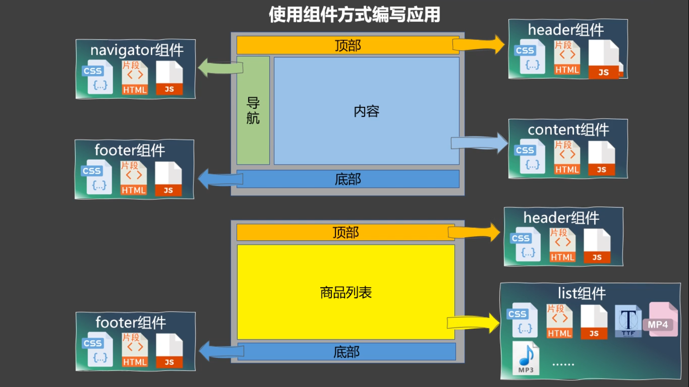
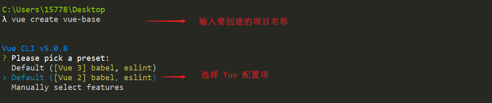
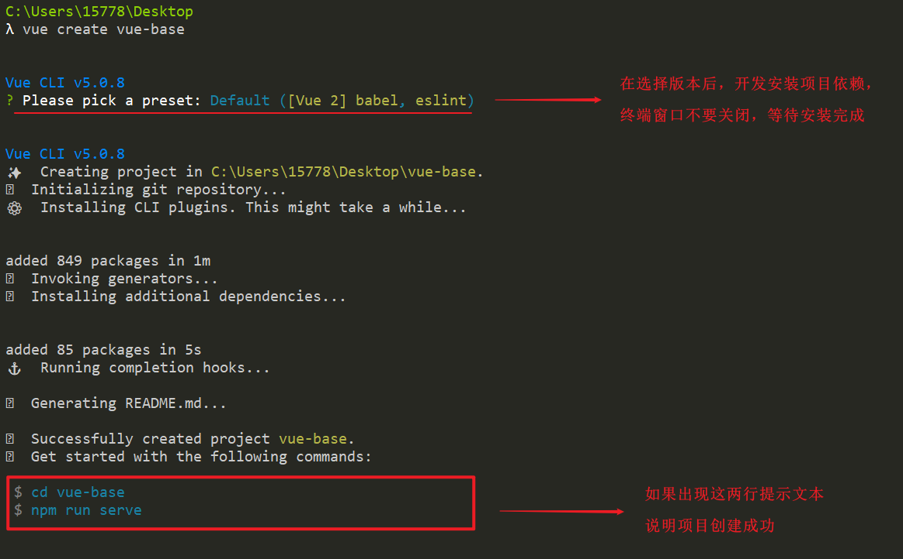
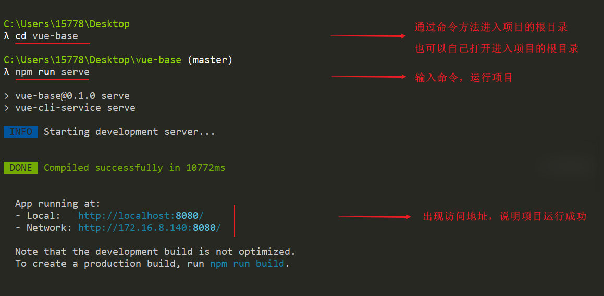
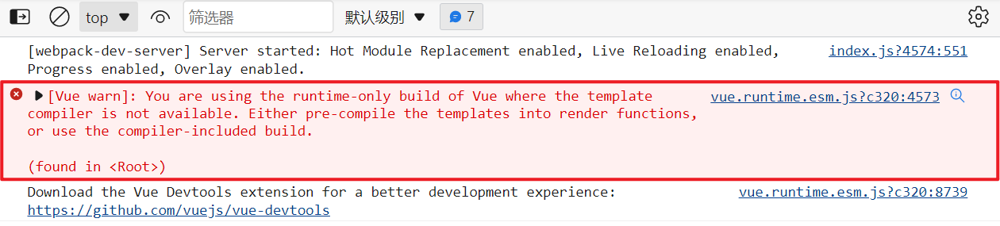
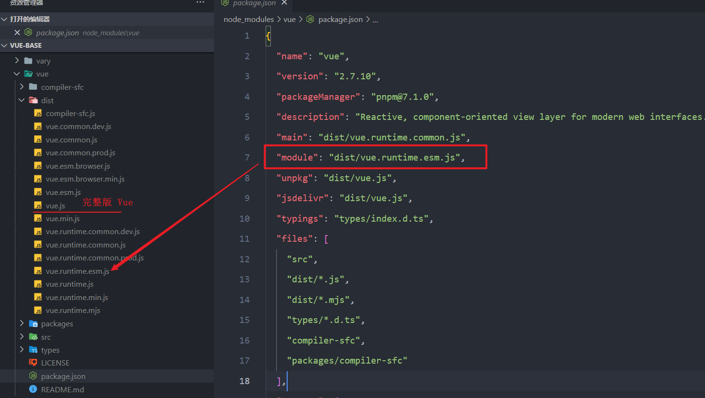
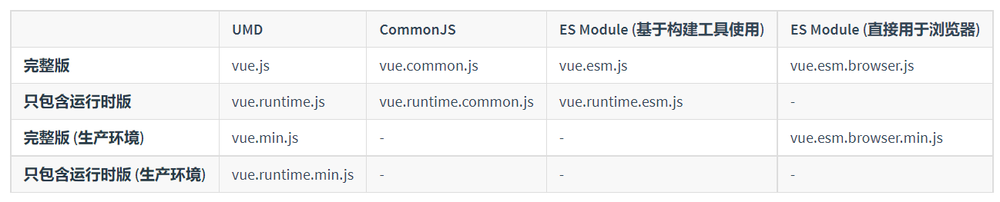

# Vue 第五天笔记

##1. 组件基础-什么是组件


###  1.1 什么是组件

​		组件可以理解是页面中的一个最小单元，通常是指将一个界面或者一个功能模块所需要的 HTML、CSS、JS 封装成一个单独的文件。我们将一个完整的页面分成很多个组件，每个组件都拥有自己的独立逻辑，最终将各个组件进行组合完整的项目。


通俗的讲：组件实现了应用中 局部功能 的代码和资源集合


**传统方式编写应用**

1. 按照功能去将 CSS、JS 拆分成一个个文件，来回实现复用
2. HTML 很难实现复用
3. 引用关系比较混乱，结构不清晰，不方便维护
4. 引入文件的时候需要注意应用的顺序，否则会引起依赖错误


**组件方式编写应用**




**如何组件的组织**

通常一个应用会以一棵嵌套的组件树的形式来组织：例如，你可能会有页头、侧边栏、内容区等组件，每个组件又包含了其它的像导航链接、博文之类的组件。


###  1.2 组件的分类


**知识点：**

在 Vue 中，组件分为两类：

1. 非单文件组件：一个文件中可以存在多个组件，文件的后缀名是 `.html` 格式的
2. 单文件组件：一个文件中只定义一个组件，文件后缀名是 `.vue`，每个单文件组件中有自己的 HTML、CSS、JS


## 2. 组件基础-组件的基本使用

> 🎯 目标：熟练非单文件组件的创建与使用的流程


###  2.1 演示不使用组件的写法

**案例效果：**

​				


**存在问题：**

1. 功能与功能之间没有明显的界限
2. 数据、方法堆叠到一起，不方便后续的维护
3. 不方便后期的复用


**落地代码：**

```html
<!DOCTYPE html>
<html lang="en">

<head>
  <meta charset="UTF-8">
  <meta http-equiv="X-UA-Compatible" content="IE=edge">
  <meta name="viewport" content="width=device-width, initial-scale=1.0">
  <title>搭建 Vue 开发环境</title>
</head>

<body>

  <div id="app">
    <div>
      <h2>学校信息</h2>
      <h5>学校名称：{{ sname }}</h5>
      <h5>学校地址：{{ address }}</h5>
      <button @click="schoolInfo">弹出我的信息</button>
    </div>
    <hr>
    <div>
      <h2>学员信息</h2>
      <h5>学校名称：{{ pname }}</h5>
      <h5>学校地址：{{ age }}</h5>
      <button @click="personInfo">弹出我的信息</button>
    </div>
  </div>

  <script src="../vue.js"></script>
  <script>
    Vue.config.productionTip = false

    const vm = new Vue({
      el: '#app',
      data: {
        sname: '北京大学',
        address: '北京海淀区',
        pname: '韦东奕',
        age: '18'
      },
      methods: {
        schoolInfo() {
          alert(this.sname)
        },
        personInfo() {
          alert(this.pname)
        }
      }
    })
  </script>
</body>

</html>
```


###  2.2 组件的使用流程步骤

**知识点：**

1. 使用 `Vue.extend(options)`，其中的 `options` 和 `new Vue(options)` 中的 `options` 几乎一样，但也有点小区别

   - el 不要写，为什么 ❓    所有的组件，最终都有一个 vm 进行管理，由 vm 决定服务哪个容器，所有的组件都跟随 vm 走

   - data 必须写成函数，为什么 ❓   避免组件后期复用时产生数据的干扰

     

2. 创建组件的三个步骤：

   - 创建组件：使用`Vue.extend(options)`方法创建组件
   - 注册组件：`new Vue({...})`时，使用`components`配置。
   - 使用组件：在父组件的 Vue 模板中使用组件，只需将组件写成 标签 即可，例如：`<Person></Person> `


**落地代码：**

```html
<!DOCTYPE html>
<html lang="en">

<head>
  <meta charset="UTF-8">
  <meta http-equiv="X-UA-Compatible" content="IE=edge">
  <meta name="viewport" content="width=device-width, initial-scale=1.0">
  <title>搭建 Vue 开发环境</title>
</head>

<body>

  <div id="app">
    <!-- 3. 使用组件 -->
    <School></School>
    <hr />
    <Student></Student>
  </div>

  <script src="../vue.js"></script>
  <script>
    Vue.config.productionTip = false

    // 1. 创建组件
    // 创建学校组件
    const School = Vue.extend({
      template: `
        <div>
          <h2>学校信息</h2>
          <h5>学校名称：{{ sname }}</h5>
          <h5>学校地址：{{ address }}</h5>
          <button @click="schoolInfo">弹出我的信息</button>
        </div>
      `,
      data() {
        return {
          sname: '北京大学',
          address: '北京海淀区',
        }
      },
      methods: {
        schoolInfo() {
          alert(this.sname)
        }
      }
    })

    // 创建学员组件
    const Student = Vue.extend({
      template: `
        <div>
          <h2>学员信息</h2>
          <h5>学校名称：{{ pname }}</h5>
          <h5>学校地址：{{ age }}</h5>
          <button @click="personInfo">弹出我的信息</button>
        </div>
      `,
      data() {
        return {
          pname: '韦东奕',
          age: '18'
        }
      },
      methods: {
        personInfo() {
          alert(this.pname)
        }
      }
    })

    const vm = new Vue({
      el: '#app',
      // 注册组件
      components: {
        School,
        Student
      }
    })
  </script>
</body>

</html>
```


###  2.3 为什么 data 需要写成一个函数

**知识点**

data 需要写成一个函数，是为了避免组件后期复用时 共用一个data，产生数据之间相互影响


**原因：**

对象本身是一个引用数据类型，当同一个组件被多次使用时，实际上引用的是同一个地址，因此只要某一个组件数据发生更改，那么会直接影响到其他组件数据，不利于组件的复用

写成函数写法可以避免这种问题的产生，是函数中每一次都会返回一个全新的对象，这样多次使用组件时，每一次都是一个全新的对象地址，不会发生数据同步问题


**演示写成对象形式**

```js
// 对象本身是一个引用数据类型，
// 当同一个组件被多次使用时，实际上引用的是同一个地址，
// 因此只要某一个组件数据发生更改，那么会直接影响到其他组件数据，不利于组件的复用
let obj = {
  pname: '韦东奕',
  age: '18'
}

// a 组件
const a = obj

// b 组件
const b = obj

a.pname = '韦神'

console.log(b.pname)
```


**演示写成函数形式**

```js
// 函数中每一次都会返回一个全新的对象
// 这样多次使用组件时，每一次都是一个全新的对象地址，不会发生数据同步问题
let obj = () => {
  return {
    pname: '韦东奕',
    age: '18'
  }
}

// a 组件
const a = obj()

// b 组件
const b = obj()

a.pname = '韦神'

console.log(a.pname)
console.log(b.pname)
```


## 3. 组件基础-嵌套组件和全局组件 

>  🎯 目标：熟练非单文件组件的创建与使用的流程


**知识点：**

1. 如果某个组件，需要在很多的地方使用，可以进行**全局注册**
2. 语法：`Vue.component('组件名', 具体的组件)`


**落地代码：**

```html
<!DOCTYPE html>
<html lang="en">

<head>
  <meta charset="UTF-8">
  <meta http-equiv="X-UA-Compatible" content="IE=edge">
  <meta name="viewport" content="width=device-width, initial-scale=1.0">
  <title>搭建 Vue 开发环境</title>
</head>

<body>

  <div id="app">
    <!-- 3. 使用组件 -->

    <!-- 写成双标签的可以渲染后面的组件 -->
    <School></School>

    <Student></School>

  </div>

  <script src="../vue.js"></script>
  <script>
    Vue.config.productionTip = false

    const Hello = Vue.extend({
      template: `
        <span>666</span>
      `
    })

    // 全局注册或获取全局组件
    // 第一个参数：组件的名称
    // 第一个参数：具体的组件
    Vue.component('Hello', Hello)

    // 1. 创建组件
    // 创建学校组件
    const School = Vue.extend({
      // components: {
      //   Hello
      // },
      template: `
        <div>
          <h2>学校信息</h2>
          <h5>学校名称：{{ sname }} <Hello></Hello></h5>
          <h5>学校地址：{{ address }}</h5>
          <button @click="schoolInfo">弹出我的信息</button>
        </div>
      `,
      data() {
        return {
          sname: '北京大学',
          address: '北京海淀区',
        }
      },
      methods: {
        schoolInfo() {
          alert(this.sname)
        }
      }
    })

    // 创建学员组件
    const Student = Vue.extend({
      // components: {
      //   Hello
      // },
      template: `
        <div>
          <h2>学员信息</h2>
          <h5>学校名称：{{ pname }} <Hello></Hello></h5>
          <h5>学校地址：{{ age }}</h5>
          <button @click="personInfo">弹出我的信息</button>
        </div>
      `,
      data() {
        return {
          pname: '韦东奕',
          age: '18'
        }
      },
      methods: {
        personInfo() {
          alert(this.pname)
        }
      }
    })

    const vm = new Vue({
      el: '#app',
      // 注册组件
      components: {
        School,
        Student
      }
    })
  </script>
</body>

</html>
```


## 4. 组件基础-App 组件 

> 🎯 目标：了解在 Vue 代码的组织方式

**知识点：**

通常使用`App`组件，作为所有组件的根组件。


**落地代码：**

```html
<!DOCTYPE html>
<html lang="en">

<head>
  <meta charset="UTF-8">
  <meta http-equiv="X-UA-Compatible" content="IE=edge">
  <meta name="viewport" content="width=device-width, initial-scale=1.0">
  <title>搭建 Vue 开发环境</title>
</head>

<body>

  <div id="app">
    <!-- 跟组件 -->
    <App />
  </div>

  <script src="../vue.js"></script>
  <script>
    Vue.config.productionTip = false

    const Hello = Vue.extend({
      template: `
        <span>666</span>
      `
    })

    // 全局注册或获取全局组件
    // 第一个参数：组件的名称
    // 第一个参数：具体的组件
    Vue.component('Hello', Hello)


    // 创建学校组件
    const School = Vue.extend({ ... })

    // 创建学员组件
    const Student = Vue.extend({ ...  })

    const App = Vue.extend({
      components: {
        School,
        Student
      },
      template:`
        <div>
            <School></School>
            <hr>
            <Student></Student>
        </div>
    `,
    })

    const vm = new Vue({
      el: '#app',
      // 注册组件
      components:{ App },
      template:`<App></App>`
    })
  </script>
</body>

</html>
```


## 5. 组件基础-注意事项 

> 🎯 目标：了解在创建组件时组件的命名

**一、关于组件名：**

1. 一个单词组成：
   - 第一种写法：(首字母小写)：`school`
   - 第二种写法：(首字母大写，推荐)：`School`
2. 多个单词组成：
   - 第一种写法：`kebab-case`命名，例如：`atguigu-school`。
   - 第二种写法：`CamelCase`命名，例如：`AtguiguSchool`。
   - 备注：可以使用`name`配置项，指定组件在开发者工具中的名字。


**二、关于组件标签：**

- 第一种写法：`<组件名></组件名>`。

- 第二种写法：`<组件名/>`


## 6. Vue.extend 的简写形式

> 🎯 目标：熟练 Vue.extend 简写方式的使用

1. **创建组件 —— 完整写法：**

   ```js
   //定义一个Person组件
   let Person = Vue.extend({
   	name:'Person',
   	template:`此处写结构`,
   	data(){
   		return {
   			/******/
   		}
   	}
   })
   ```

2. **创建组件 —— 简写方式：**

   所谓简写方式，其实就是不写`Vue.extend()`，直接写配置对象。

   ```js
   //定义一个Person组件
   let Person = {
   	name:'Person',
   	template:`此处写结构`,
   	data(){
   		return {
   			/******/
   		}
   	}
   }
   ```


## 8. 非单文件组件和单文件组件

> 🎯 目标：能够说出非单文件组件和单文件组件的区别

### 8.1 非单文件组件


在前面的课程中，我们使用 `Vue.extend()` 创建组件 或者使用 `Vue.component` 来定义全局组件，然后使用`new Vue({ el: '#app'})` 在每个页面内指定一个容器元素。


这种方式很多小规模的项目中运作的很好，在这些项目里 JavaScript 只被用来加强特定的视图。但当在更复杂的项目中，或者你的前端完全由 JavaScript 驱动的时候，下面这些缺点将变得非常明显：


1. **命名冲突**：全局定义强制要求每个 component 中的命名不得重复
2. **缺少代码提示和高亮**：字符串模板中没有代码提示以及语法高亮
3. **组件不支持 CSS**：不支持 CSS意味着当 HTML 和 JavaScript 组件化时，CSS 明显被遗漏
4. **没有构建步骤**： 限制只能使用 HTML 和 ES5 JavaScript，而不能使用预处理器，如：Babel，写代码只是项目开发一环，还要考虑：开发效率、预编译工具、发布、测试、代码规范、可维护性等，这种如果没有经过构建，可能都无法实现。


### 8.2 单文件组件


为了解决以上所有问题提供方法，Vue 提供了一种件扩展名为 `.vue` 的 **single-file components (单文件组件)**，在单文件组件中，并且还可以使用 webpack 或 Browserify 等构建工具。


创建一个单文件组件的案例，演示单文件组件是如何解决以上问题的：

```vue
<template>
  <p>{{ greeting }} World!</p>
</template>

<script>
module.exports = {
  data: function() {
    return {
      greeting: "Hello"
    };
  }
};
</script>

<style scoped>
p {
  font-size: 2em;
  text-align: center;
}
</style>
```


体验后：

1. 有完整的代码提示、提交高亮效果
2. 组件不仅支持 HTML、JS，也支持 CSS，并且可以开启 CSS 的作用域
3. 支持 ES6 的模块化写法


##  9. 认识 VueComponent 构造函数

> 🎯 目标：了解 VueComponent 构造函数是这么进行解析的

**知识点：**

1. 组件的本质是一个构造函数，名为：`VueComponent`。
2. `VueComponent`，不是我们定义的，也不是引入了`vue.js` 就有的，而是`Vue.extend()`生成的。
3. `Vue.extend()`每次生成的都是一个【全新的】`VueComponent`构造函数！（这个点以后会很有用）。
4. 我们只需要写 `<Student></Student>` 或 `<Student/>` ，`Vue`就会帮我们执行： `new VueComponent(options)`。
5. 关于`this`的指向：

   - `new Vue(options)`中，`this`指向是`vm`。     

   - `Vue.extend(options)`中：`this`指向是`vc`。   
6. 备注：`vc`是一个小型的`vm`，但与`vm`也有点小不同，例如：`vm`可以拥有`el`，而`vc`不能拥有。


**思路推理**

> 可以根据这个思路，多推理几遍，加深印象


1. 在组件内部 methods 中打印 this，观察打印的结果：`VueComponent { xxxx }`

2. Vue 组件的本质是一个构造函数

   - 先验证： `console.log(typeof(Student))`，打印的结果是 `function`
   - 再验证：`console.log(Student)`,打印的结果是 `VueComponent (options) { xxx }`

   

3. 既然 Vue 组件的本质是一个构造函数，那么可以直接 `new Student({ xxx })`吗

   - 不能直接 new
   - 在 Vue 内部，当我们把组件当成 `<Student />` 标签使用时，Vue 会帮助我们进行实例化对象，也就是会自动帮助我们 `new Student({ xxx })`
   - 在 `new Student({ xxx })`时，会将 `Vue.extend(options)` 传给 `new Student({options})`
   - **因此：`VueComponent`，不是我们定义的，不是引入了`vue.js` 就有的，而是`Vue.extend()`生成的**
   - 也就是说，`const Student = new Student() `，Student  只是一个周转的变量，里面存储着 `VueComponent`

   ```js
   function extend () {
     return function VueComponent () {
       console.log('xxxxxxxxxx')
     }
   }
   
   const Student = extend()
   
   console.log(typeof(extend))
   console.log(Student)
   ```

   

4. `Vue.extend()`每次生成的都是一个【全新的】`VueComponent`构造函数！（这个点以后会很有用）

   ```js
   function extend () {
     return function VueComponent () {
       console.log('xxxxxxxxxx')
     }
   }
   
   const School = extend()
   const Student = extend()
   
   console.log(typeof(extend))
   console.log(Student)
   console.log(School === Student)
   ```

   ```js
   Vue.extend = function (extendOptions) {
     // ....
     var Sub = function VueComponent(options) {
         this._init(options);
     };
   
     // ....
     return Sub;
       
     // return function VueComponent(options) {
     //    console.log('xxxxxxxxxx')
     // };
   };
   ```


## 10. Vue 脚手架 Vue Cli

> 🎯 目标：熟练 Vue Cli 的安装和使用

### 10.1 安装 Vue Cli


**知识点：**

Vue CLI 是一个基于 Vue.js 进行快速开发的完整系统。


脚手架是开发 Web 应用的必备选择，能够帮助程序员充分利用 Webpack、Babel、ESLint 等工具辅助项目开发，脚手架确保了各种构建工具能够基于智能的默认配置即可平稳衔接，让程序员专注于业务功能的开发，而不必花好几天去纠结配置的问题。


**安装 Vue Cli：**


可以使用下列任一命令安装 Vue Cli：

```shell
npm install -g @vue/cli
# OR
yarn global add @vue/cli
```


用这个命令来检查其版本是否正确：

```shell
vue --version
```


### 10.2 创建项目


**创建项目：**

```shell
vue create 项目名称

例如：

vue create hello-world
```


**图示：**

1. 在需要创建项目的目录中输入创建项目的命令

   

   

2. Vue Cli 开始安装依赖，等待安装完成

   


3. 安装完成后，进入项目的根目录下，即可运行项目

   

   

4. 在浏览器访问项目地址即可


### 10.3 分析 Vue 脚手架


**Vue Cli 脚手架目录分析**

```reStructuredText
├── node_modules 项目依赖包
├── public
│   ├── favicon.ico: 页签图标
│   └── index.html: 主页面
│
├── src
│   ├── assets: 存放公共静态资源（公用的：图片、字体等等）
│   │   └── logo.png
│   │ 
│   │── components: 存放组件
│   │   └──HelloWorld.vue
│   │ 
│   │── App.vue: 汇总所有组件
│   │── main.js: 入口文件
│
├──.gitignore : git忽略清单
├── babel.config.js : babel配置文件
├── jsconfig.json : Vsode配置文件
├── package-lock.json ：包版本清单
├── package.json : 依赖包清单
├── README.md : 应用描述文件
├── vue.config.js : 脚手架配置文件
```


**public/index.html 文件分析**

```html
<!DOCTYPE html>
<html lang="">
  <head>
    <meta charset="utf-8">
    <!-- 让IE浏览器，IE8/9及以后的版本都会以最高版本 IE(edge) 来渲染页面 -->
    <meta http-equiv="X-UA-Compatible" content="IE=edge">
    <!-- 使用 meta 设置视口，用于移动端开发 -->
    <meta name="viewport" content="width=device-width,initial-scale=1.0">
    <!-- BASE_URL 是底层定义的一个环境变量 -->
    <link rel="icon" href="<%= BASE_URL %>favicon.ico">
    <!-- index.html 文件是一个会被 html-webpack-plugin 的 webpack 插件解析处理的 -->
    <!-- 因此这句话是给 webpack 插件来识别的，用于查找 package.json 这个文件中的 name 作为项目名称 -->
    <!-- 开发中需要改成自己的项目名称 -->
    <title><%= htmlWebpackPlugin.options.title %></title>
  </head>
  <body>
    <noscript>
      <strong>We're sorry but <%= htmlWebpackPlugin.options.title %> doesn't work properly without JavaScript enabled. Please enable it to continue.</strong>
    </noscript>
    <div id="app"></div>
    <!-- built files will be auto injected -->
  </body>
</html>

```


##  11. 入口文件中的 render 函数

> 🎯 目标：能够说出为什么在脚手架中不能使用 template 需要使用 render 函数


### 11.1 render 函数的作用


`Vue` 推荐在绝大多数情况下使用模板来创建你的 `HTML`。然而在一些场景中，真的需要 `JavaScript` 的完全编程的能力。这时可以用渲染函数，它比模板更接近编译器。

`render` 函数和 `template` 一样都是`创建 html 模板`的，但是有些场景中用 `template` 实现起来代码冗长繁琐而且有大量重复，这时候就可以用 `render` 函数


```js
new Vue({
  render: (h) => h(App),
  router
}).$mount('#app')


new Vue({
  render: (createElement) => createElement(App),
  router
}).$mount('#app')

new Vue({
  render: (createElement) => createElement(h2, null, '段落'),
  router
}).$mount('#app')

```


### 11.2 Vue 不同的构建版本


**1. 知识点：**

在非单文件组件中，渲染模板都是使用 `template` 配置项，但是在脚手架的实例中配置 `template` 发现模板不仅不能解析，在浏览器控制还提示错误，错误显示目前项目中使用的 `Vue`是只包含运行时的版本的 `Vue`，如下图：




通过依赖关系的查找路线，从 Vue 的 pageage.json 可以看到 Vue 引入的并不是完整版本的 Vue：




这时候你可以在入口文件中将依赖的版本改成完成版的 `vue.js`，会发现错误消失了，但是我们并不推荐这么做，因为 vue.js 文件体积比较大，会影响项目启动时的加载速度

```js
import Vue from 'vue/dist/vue'
```


**2. Vue 的不同版本**

这是因为 Vue 包含不同的版本，`在脚手架中引入的是只包含运行时的 Vue 版本`




1. **完整版**：同时包含 `编译器` 和 `运行时` 的版本
   - 例如：`vue.js`、`vue.min.js` 、`vue.common.js`、`vue.esm.js`
2. **运行时**：用来创建 Vue 实例、渲染并处理虚拟 DOM 等的代码，体积小、效率高，基本上就是除
   去编译器的代码
   - `vue.runtime.js`、`vue.runtime.common.js`、`vue.runtime.esm.js`
3. **编译器**：用来将模板字符串编译成为 JavaScript 渲染函数的代码，体积大、效率低


**3. 不同的模块化**


从上面的图可以看到，不同的版本又分别使用了不同的模块化实现方案：

	1. UMD：UMD 版本可以通过 `<script>` 标签直接用在浏览器中
 	2. CommonJS：CommonJS 版本用来配合老的打包工具，比如： Browserify
 	3. ES Module：ES6 新增的模块化规范


**4. 运行时 + 编译器  VS 只包含运行时**


如果你需要在客户端编译模板 (比如传入一个字符串给 `template` 选项，或挂载到一个元素上并以其 DOM 内部的 HTML 作为模板)，就将需要加上编译器，即完整版：

```js
// 需要编译器
new Vue({
  template: '<div>{{ hi }}</div>'
})

// 不需要编译器
new Vue({
  render (h) {
    return h('div', this.hi)
  }
})
```


当使用 `vue-loader` 或 `vueify` 的时候，`*.vue` 文件内部的模板会在构建时预编译成 JavaScript。你在最终打好的包里实际上是不需要编译器的，所以只用运行时版本即可。

因为 `运行时版本相比完整版体积要小大约 30%，所以应该尽可能使用这个版本`


`vue-loader + vue-template-compiler` + `运行时的 JS`，保证了我们 Vue 的正常工作


## 12. (拓展)代码格式化问题

> ESLint 与 Prettier 配合解决代码格式问题


**是什么？**

1. `ESLint` 是一个插件， **用来对 `javascript` 代码检测质量的工具** ，说白了就是做 **对代码质量检测使用的**

   - 例如未使用的变量，未定义的引用，比较时使用 ===，禁止不必要的括号 等等代码质量检测

   - `ESLint`大大提高了团队协作的代码规范统一性，以及个人的代码质量

     

2. `Prettier` 的作用主要是进行代码格式化

   - `ESLint` 的作用是代码质量检测，`Prettier` 的作用则主要是代码格式化
   - `ESLint` 只能格式化 `js/ts` 文件，而 `Prettier` 支持多种文件


`Prettier` 自身的规范倾向于个人 / 团队的代码风格的规范或统一，例如单引号还是双引号，每行最大长度，等号左右空格，使用 tab 还是 空格等等，将`Prettier` 与 `ESLint` 一起协同工作犹如如虎添翼


**怎么配置**


1. VsCode 插件安装两个插件 `Eslint`、`Prettier - Code formatter`

2. 在项目的根目录下创建 `.vscode` 文件夹，注意：文件夹名字前面带 **`.`** 点❗

3. 在 `.vscode` 文件夹下，创建 `settings.json` 文件，用来对 `当前项目`进行格式化

   ```json
   {
     // eslint 保存格式化
     "eslint.enable": true,
     // 执行 eslint 检测的时间，onType 输入时
     "eslint.run": "onType",
     //指定 eslint 所处理的文件的后缀
     "eslint.options": {
       "extensions": [".js", ".ts", ".jsx", ".tsx", ".vue"]
     },
     // 编辑器保存格式化
     "editor.codeActionsOnSave": {
       "source.fixAll": true,
       "source.fixAll.eslint": true
     },
     // .ts 文件格式化程序
     "[typescript]": {
       "editor.defaultFormatter": "esbenp.prettier-vscode"
     },
   
     // .vue 文件格式化程序
     "[vue]": {
       "editor.defaultFormatter": "esbenp.prettier-vscode"
     },
   
     "[json]": {
       "editor.defaultFormatter": "esbenp.prettier-vscode"
     },
   
     // 操作时作为单词分隔符的字符
     "editor.wordSeparators": "`~!@#%^&*()=+[{]}\\|;:'\",.<>/?",
   
     // 一个制表符等于的空格数
     "editor.tabSize": 2,
   
     // 行尾字符
     // "files.eol": "\n",
   
     // 保存到额时候用使用 prettier 进行格式化
     "editor.formatOnSave": true,
     
     // // 不要有分号
     // "prettier.semi": false,
     // // 使用单引号
     // "prettier.singleQuote": true,
     // // 默认使用prittier作为格式化工具
     // "editor.defaultFormatter": "esbenp.prettier-vscode",
     // // 一行的字符数，如果超过会进行换行，默认为80
     // "prettier.printWidth": 200,
     // // 尾随逗号问题，设置为none 不显示 逗号
     // "prettier.trailingComma": "none"
   }
   
   ```

   

4. 在项目根目录下创建 `.prettierrc` 文件，用来配置

   ```json
   {
     "semi": false,
     "singleQuote": true,
     "useTabs": false,
     "tabWidth": 2,
     "printWidth": 130,
     "trailingComma": "none"
   }
   
   ```

   


