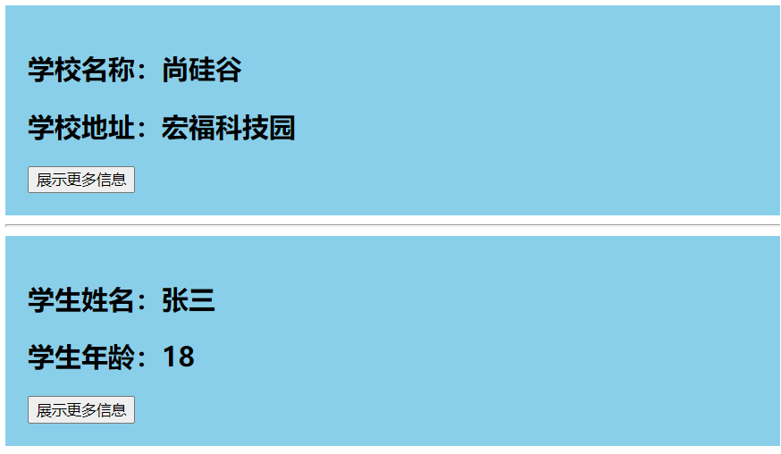
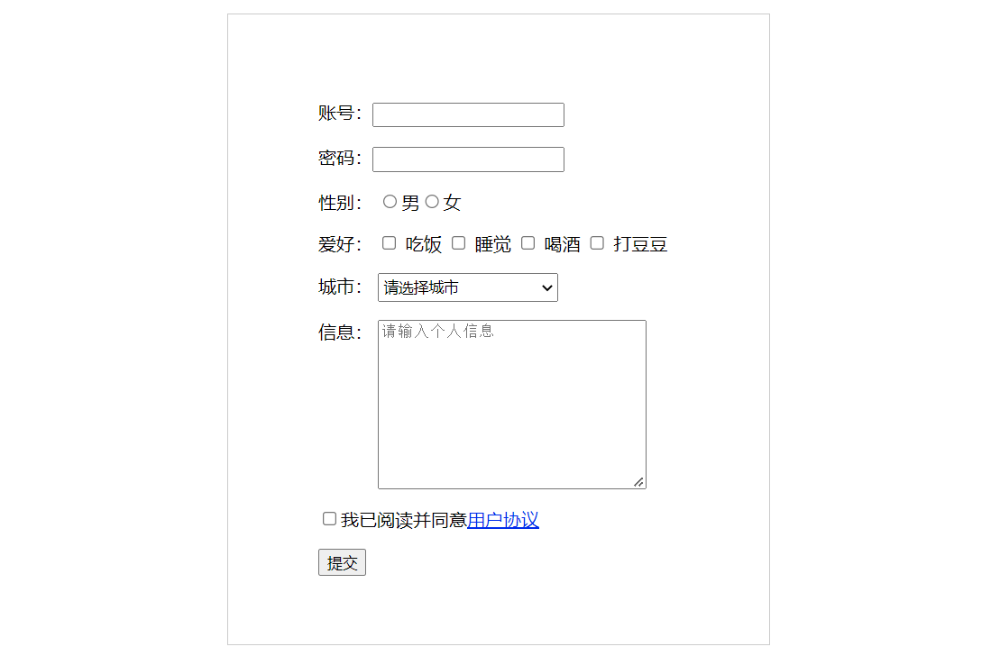
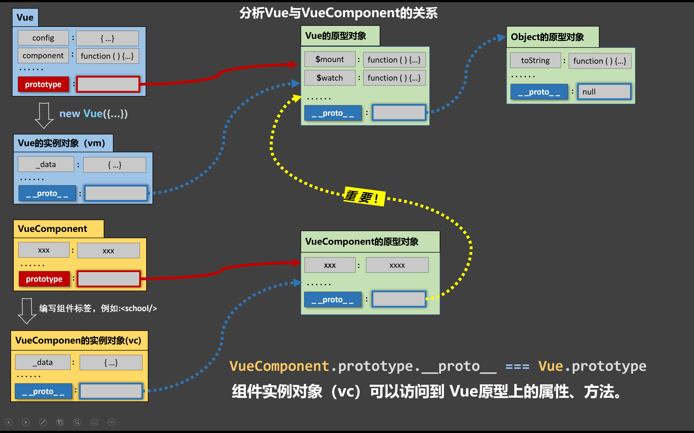

#   Vue 第六天笔记


## 1. scoped 编写局部样式

> 🎯 目标：能够知道 scoped 属性 的含义 

**知识点**


1. 在 Vue 单文件组件中，当 `<style>` 标签有 `scoped` 属性时，它的 CSS 只作用于当前组件中的元素
2. 一般我们建议每个组件中 `<style>` 标签都添加属性，除非你故意设计成需要对其他组件有
3. 一般 `App.vue` 根组件中的`<style>` 标签我们不加`scoped` 属性


**scoped 实现局部样式的原理：**

通过使用 PostCSS 插件给标签添加自定义属性，最终会将类名 + 自定义属性结合，来实现转换

```vue
// ---------------------
// ------- 转换前 -------
// ---------------------

<style scoped>
.example {
  color: red;
}
</style>

<template>
  <div class="example">hi</div>
</template>

// ---------------------
// ------- 转换后 -------
// ---------------------

<style>
.example[data-v-f3f3eg9] {
  color: red;
}
</style>

<template>
  <div class="example" data-v-f3f3eg9>hi</div>
</template>
```


**落地代码**

1. 先将 `School` 和 `Student` 组件中 `<style>` 标签的 `scoped` 属性去掉

2. 在将 `School` 和 `Student` 组件中 <template> 中根元素的类名改成一致

   ```vue
   <template>
     <div class="demo">
       <h2>学生姓名：{{ name }}</h2>
       <h2>学生年龄：{{ age }}</h2>
       <button @click="showMore">展示更多信息</button>
     </div>
   </template>
   
   <script>
   // ......
   </script>
   
   <style>
   .demo {
     background-color: skyblue;
     padding: 20px;
   }
   </style>
   
   ```

   ```vue
   <template>
     <!-- 组件的结构 -->
     <div class="demo">
       <h2>学校名称：{{ name }}</h2>
       <h2>学校地址：{{ address }}</h2>
       <button @click="showMore">展示更多信息</button>
     </div>
   </template>
   
   <script>
   // ......
   </script>
   
   <style>
   /* 组件的样式 */
   .demo {
     background-color: pink;
     padding: 20px;
   }
   </style>
   
   ```

   

3. 在浏览器中，查看效果，样式冲突，只需要添加再次给 `<style>` 标签的 `scoped` 添加属性，即可还原

   


## 2. 语法检测的配置

> 🎯 目标：了解如何避过语法检测

1. 第一种方式：`// eslint-disable-next-line`

   - 关闭配置项下一行代码的语法检查

   

2. 第二种方式：`/* eslint-disable */`

   - 配置项以下所有代码都会忽略语法检查

   

3. 第三种方式：`vue.config.js`中配置 ，具体配置如下：

   ```js
   const { defineConfig } = require('@vue/cli-service')
   
   module.exports = defineConfig({
     // 默认情况下 babel-loader 会忽略所有 node_modules 中的文件。
     // 你可以启用本选项，以避免构建后的代码中出现未转译的第三方依赖。
     transpileDependencies: true,
   
     // 是否在开发环境下通过 eslint-loader 在每次保存时 lint 代码。
     lintOnSave:false //追加这句话，用于关闭语法检查。
   })
   
   ```

   备注：```vue.config.js```可以对脚手架进行个性化定制，详情见：https://cli.vuejs.org/zh


## 3. 表单数据收集

> 🎯 目标：掌握 Vue 进行表单收集的要点




### 3.1  静态表单


**页面基础模板结构**

```html
<template>
  <div class="container">
    <p>账号：<input type="text" /></p>
    <p>密码：<input type="password" /></p>
    <p>性别：<input type="radio" name="gender" />男<input type="radio" name="gender" />女</p>
    <p>
      爱好：
      <label for="cf"><input id="cf" type="checkbox" /> 吃饭 </label>
      <label for="sj"><input id="sj" type="checkbox" /> 睡觉 </label>
      <label for="hj"><input id="hj" type="checkbox" /> 喝酒 </label>
      <label for="dd"><input id="ddd" type="checkbox" /> 打豆豆 </label>
    </p>
    <p>
      城市：
      <select>
        <option value="">请选择城市</option>
        <option value="bj">北京</option>
        <option value="sh">上海</option>
        <option value="sz">深圳</option>
        <option value="gz">广州</option>
      </select>
    </p>
    <p>
      信息：
      <textarea placeholder="请输入个人信息" name="" id="" cols="30" rows="10"></textarea>
    </p>
    <p><input type="checkbox" />我已阅读并同意<a href="https://www.baidu.com">用户协议</a></p>
    <button>提交</button>
  </div>
</template>

<script>
export default {
  name: 'RegisterPage'
}
</script>

<style scoped>
.container {
  width: 320px;
  margin: 20px auto;
  border: 1px solid #ccc;
  padding: 60px 80px;
}
textarea {
  vertical-align: top;
}
select {
  width: 160px;
  height: 26px;
}
</style>

```


### 3.2 收集表单数据


**知识点：**

1. 若：`<input type="text"/>`，则`v-model`收集的是`value`值，用户输入的就是`value`值。
2. 若：`<input type="radio"/>`，则`v-model`收集的是`value`值，且要给标签配置`value`值。
3. 若：`<input type="checkbox"/>`
   - 没配置`input`的`value`属性，那么收集的就是`checked`（勾选 或 未勾选，是布尔值）
   - 配置了`input`的`value`属性：
     - `v-model`的初始值是非数组s，那么收集的就是`checked`（勾选 或 未勾选，是布尔值）。
     - `v-model`的初始值是数组，那么收集的的就是`value`组成的数组。


**落地代码：**

```html
<template>
  <div class="container">
    <p>账号：<input type="text" v-model="userInfo.account" /></p>
    <p>密码：<input type="password" v-model="userInfo.password" /></p>
    <p>
      性别：
      <label for="man"><input id="man" type="radio" name="gender" v-model="userInfo.gender" value="man" />男</label>
      <label for="woman"><input id="woman" type="radio" name="gender" v-model="userInfo.gender" value="woman" />女</label>
    </p>
    <p>
      爱好：
      <label for="cf"><input id="cf" type="checkbox" v-model="userInfo.likes" value="cf" /> 吃饭 </label>
      <label for="sj"><input id="sj" type="checkbox" v-model="userInfo.likes" value="sj" /> 睡觉 </label>
      <label for="hj"><input id="hj" type="checkbox" v-model="userInfo.likes" value="hj" /> 喝酒 </label>
      <label for="dd"><input id="dd" type="checkbox" v-model="userInfo.likes" value="dd" /> 打豆豆 </label>
    </p>
    <p>
      城市：
      <select v-model="userInfo.city">
        <option value="">请选择城市</option>
        <option value="bj">北京</option>
        <option value="sh">上海</option>
        <option value="sz">深圳</option>
        <option value="gz">广州</option>
      </select>
    </p>
    <p>
      信息：
      <textarea v-model="userInfo.info" placeholder="请输入个人信息" name="" id="" cols="30" rows="10"></textarea>
    </p>
    <p><input type="checkbox" v-model="userInfo.isAgree" />我已阅读并同意<a href="https://www.baidu.com">用户协议</a></p>
    <button @click="submit">提交</button>
  </div>
</template>

<script>
export default {
  name: 'RegisterPage',
  data() {
    return {
      userInfo: {
        account: '', // 账号
        password: '', // 密码
        gender: '', // 性别
        city: '', // 城市
        likes: [], // 爱好
        info: '', // 其他信息
        isAgree: '' // 是否同意协议
      }
    }
  },
  methods: {
    submit() {
      console.log(this.userInfo)
    }
  }
}
</script>

<style scoped>
.container {
  width: 320px;
  margin: 20px auto;
  border: 1px solid #ccc;
  padding: 60px 80px;
}
textarea {
  vertical-align: top;
}
select {
  width: 160px;
  height: 26px;
}
</style>

```


## 4. ref 属性的使用

> 🎯 目标：掌握 Vue 中 ref 属性的使用

**知识点：**


`ref` 被用来给元素或子组件注册引用信息

- 如果在普通的 DOM 元素上使用，引用指向的就是 DOM 元素
- 如果用在子组件上，引用就指向组件实例


**落地代码：**


App.vue

```vue
<template>
  <div class="app">
    <h3 ref="element">App 根组件</h3>
    <button @click="getElement">获取 h3 标签内容</button>
    <button @click="getVc">获取子组件实例</button>
    <hr />
    <School ref="vc" />
  </div>
</template>

<script>
//引入School组件
import School from './components/School'

export default {
  name: 'App',
  components: { School },
  methods: {
    getElement() {
      console.log(this)
      // 用在普通的元素上，就是获取 DOM 元素
      console.log(this.$refs.element)
    },
    getVc() {
      console.log(this.$refs.vc)
    }
  }
}
</script>

<style>
.app {
  background-color: lightpink;
  padding: 100px 300px;
}
</style>

```


School.vue

```vue
<template>
  <!-- 组件的结构 -->
  <div class="demo">
    <h2>{{ info }}</h2>
  </div>
</template>

<script>
export default {
  name: 'SchoolPage',
  data() {
    return {
      info: '瘦巴巴的老爷们, 一起走哇~~~~'
    }
  }
}
</script>

<style scoped>
/* 组件的样式 */
.demo {
  background-color: lightblue;
  padding: 40px;
}
</style>

```


## 5. Vue 插件

> 🎯 目标：掌握 Vue 插件的使用方法

**知识点：**


`插件`通常用来**为 Vue 添加全局功能**，插件的功能范围没有严格的限制，——一般有下面几种：


1. 添加全局方法或者 property
2. 添加全局资源：指令/过滤器/过渡等
3. 添加 Vue 实例方法，通过把它们添加到 `Vue.prototype` 上实现
4. 一个库，提供自己的 API，同时提供上面提到的一个或多个功能
5. ......


插件需要暴露一个 `install` 方法，这个方法的第一个参数是 `Vue` 构造器，第二个参数是一个可选的选项对象：

```js
const plugin = {
  install (Vue, options) {
    // 添加全局方法
    Vue.globalMethod = function () { ... }
    
    // 添加全局 property
    Vue.globalProperty = 'xxx'
                                    
    // 添加全局指令
    Vue.directive('xx', { ... })
    
    // 添加全局过滤器
    Vue.filter('xx', { ... })
    
    // 添加全局组件
    Vue.component('xx', { ... })
 
    // 添加实例方法
    Vue.prototype.$myMethod = function () { ... }
  }
}
    
export default plugin
```

```vue
import plugin from './plugin.js'

Vue.use(plugin)
```


## 6. props 父往子传值

> 🎯 目标：掌握 Vue 中如何使用 props 父往子传值

### 6.1 props 的基本使用


**知识点：**


`props` 可以是数组或对象，用于接收来自父组件的数据。

- `props `是简单数组，在数据中直接写上需要接收的数据属性即可
- `props `若写成对象，可以通过对象配置高级选项，如类型检测、自定义验证和设置默认值
- **注意：接收到的`prop`最终都出现在：组件实例 —— `vc`上**

```js
export default {
  props: ['a', 'b', 'c']
}
```

```js
export default {
  props: {
    a: {
      type: Number, // 检测传递的数据类型
      default: 0, // 设置默认值
      required: true, // 设置属性是必填项
      // 自定义验证
      validator: function (value) {
        return value
      }
    }
  }
}
```


**落地代码：**


App.vue

```vue
<template>
  <div class="app">
    <h3>App 根组件</h3>
    <hr />
    <Student :grade="num" :money="money" />
  </div>
</template>

<script>
//引入School组件
import Student from './components/Student'

export default {
  name: 'App',
  components: { Student },
  data() {
    return {
      num: 6,
      money: 1000
    }
  }
}
</script>

<style>
.app {
  background-color: lightpink;
  padding: 100px 300px;
}
</style>

```


Student.vue

```vue
<template>
  <!-- 组件的结构 -->
  <div class="demo">
    <h2>学生：{{ name }}</h2>
    <p>{{ grade }} 年级，品学兼优，获得 {{ money }} 奖学金</p>
  </div>
</template>

<script>
export default {
  name: 'SchoolPage',
  data() {
    return {
      name: 'Tom'
    }
  },
  props: ['grade', 'money']
}
</script>

<style scoped>
/* 组件的样式 */
.demo {
  background-color: lightblue;
  padding: 40px;
}
</style>

```


### 6.2 props 不可进行修改


**知识点：**


1. `props`是只读的，不可修改。
2. 对于基本类型的`props`：一旦修改，直接就会报错。
 3. 对象或数组类型的`props`：
          1. 若修改的是整个对象或数组（地址值发生变化），会报错。
       2. 若修改的是对象或数组中的内容（地址值不变），不会报错。


所有的 `prop` 都使得其父子 prop 之间形成了一个**单向下行绑定**：父级 prop 的更新会向下流动到子组件中，但是反过来则不行。这样会防止从子组件意外变更父级组件的状态，从而导致你的应用的数据流向难以理解。


**落地代码：**

```vue
<Student :grade="num" :money="money" :obj="{ say: '你要更加努力' }" />
```


```vue
<template>
  <!-- 组件的结构 -->
  <div class="demo">
    <h2>学生：{{ name }}</h2>
    <p>{{ grade }} 年级，品学兼优，获得 {{ money }} 奖学金</p>
    <p>{{ obj.say }}</p>

    <button @click="handler">拿来偷偷买皮肤</button>
  </div>
</template>

<script>
export default {
  name: 'SchoolPage',
  data() {
    return {
      name: 'Tom'
    }
  },
  props: ['grade', 'money', 'obj'],
  methods: {
    handler() {
      // 对于基本类型的props：一旦修改，直接就会报错。
      // eslint-disable-next-line
      // console.log((this.money -= 10))

      // 若修改的是对象或数组中的内容（地址值不变），不会报错。
      // eslint-disable-next-line
      // console.log((this.obj.say = '我会的'))

      // 若修改的是整个对象或数组（地址值发生变化），但是会报错。
      // eslint-disable-next-line
      console.log((this.obj = { say: '今晚就玩王者' }))
    }
  }
}
</script>

<style scoped>
/* 组件的样式 */
.demo {
  background-color: lightblue;
  padding: 40px;
}
</style>

```


### 6.3 props 的三种接收方式


**知识点：**


1. 第一种方式（只接收）：

   ```js
   props:['a']
   ```

   

2. 第二种方式（接收 + 限制类型）：

   ```js
   props:{
     a:String
   }
   ```


3. 第三种方式（接收、限制类型、限制必要性、指定默认值）

   ```js
   props:{
     a:{
       type:String, // 检测传递的数据类型
       required:true, // 设置属性是必填项
       default:'Tom' // 默认值
     }
   }
   ```


**落地代码：**


Student.vue

```vue
<template>
  <!-- 组件的结构 -->
  <div class="demo">
    <h2>学生：{{ name }}</h2>
    <p>{{ grade }} 年级，品学兼优，获得 {{ money }} 奖学金</p>
    <p>{{ obj.say }}</p>

    <button @click="handler">拿来偷偷买皮肤</button>
  </div>
</template>

<script>
export default {
  name: 'SchoolPage',
  data() {
    return {
      name: 'Tom'
    }
  },
  // 第一种方式：
  // props: ['grade', 'money', 'obj'],

  // 第二种方式：接收 + 限制类型
  // props: {
  //   grade: String,
  //   money: Number,
  //   obj: Object
  // },

  // 第三种方式：接收、限制类型、限制必要性、指定默认值
  props: {
    grade: {
      type: String, // 类型是 String
      required: true // 设置属性是必填项
    },

    money: {
      type: Number, // 类型是 Number
      required: true // 设置属性是必填项
    },

    obj: {
      type: Object,
      // eslint-disable-next-line
      // 如果是函数、数组默认值需要通过函数返回
      default: () => {
        return { say: '你要更加努力' }
      },
      required: true,
      // 如果需要对对象中的属性进行数据转换
      validator: function (value) {
        const newObj = {}
        for (const key in value) {
          if (key === 'num') value[key] = Number(value[key])
          newObj[key] = value[key]
        }
        return newObj
      }
    }
  },
}
</script>

<style scoped>
/* 组件的样式 */
.demo {
  background-color: lightblue;
  padding: 40px;
}
</style>

```


## 7. 一个重要的内置关系


`VueComponent.prototype.__proto__ === Vue.prototype`，组件实例对象（vc）可以访问到 Vue原型上的属性、方法。




