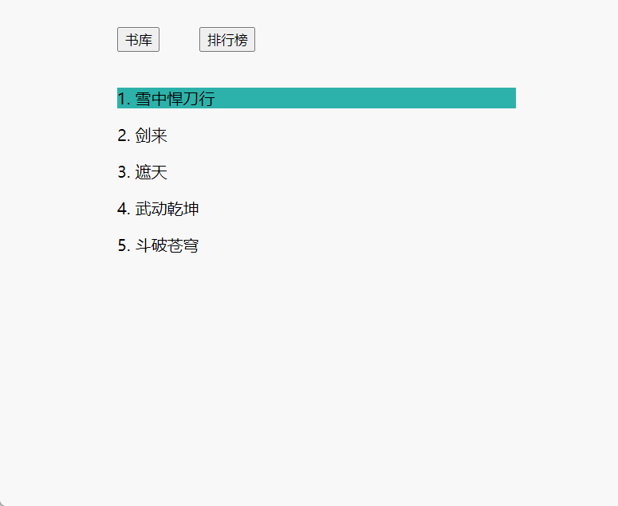

# Vue 第八天


## 1. 动态组件-component


**知识点：**


有的时候，在不同组件之间进行动态切换是非常有用的，比如在一个多标签的界面里：




想实现这样的功能，通过 Vue 的 `<component>` 组件加一个特殊的 `is` attribute 来实现：

```html
<!-- 组件会在组件的名字改变时改变 -->
<component v-bind:is="componentName"></component>
```


**落地代码：**

App.vue

```vue
<template>
  <div class="box">
    <button @click="componentId = 'Book'">书库</button>
    <button @click="componentId = 'Rank'">排行榜</button>

    <component :is="componentId"></component>
  </div>
</template>

<script>
  import Book from './components/Book.vue'
  import Rank from './components/Ranking.vue'

  export default {
    name: 'App',
    data() {
      return {
        componentId: Book
      }
    },
    components: {
      Book,
      Rank
    }
  }
</script>

<style>
.box {
  width: 400px;
  margin: 20px auto;
}

button {
  margin: 20px;
}

button:first-child {
 margin-left: 0px;
}
</style>
```


Book.vue

```vue
<template>
  <div>
    <p
      v-for="item in bookList"
      :key="item.id"
      :class="{ isActive: item.id === index }"
      @click="handler(item)"
     >
      {{item.id}}. {{ item.name }}
    </p>
  </div>
</template>

<script>
  export default {
    name: 'VBook',
    data () {
      return {
        index: 1,
        bookList: [
          { id: 1, name: '雪中悍刀行' },
          { id: 2, name: '剑来' },
          { id: 3, name: '遮天' },
          { id: 4, name: '武动乾坤' },
          { id: 5, name: '斗破苍穹' }
        ]
      }
    },
    mounted() {
      console.log('1111')
    },
    methods: {
      handler (item) {
        this.index = item.id
      }
    }
  }
</script>

<style scoped>
.isActive {
  background-color: lightseagreen;
}
</style>
```


Ranking.vue

```vue
<template>
  <div>
    <p>
      1. 《雪中悍刀行》：江湖是一张珠帘。
      大人物小人物，是珠子，大故事小故事，是串线。
      情义二字，则是那些珠子的精气神。 ———— 开始收官中。
      最终章将以那一声“小二上酒”结尾。
    </p>

    <p>
      2.《剑来》大千世界，无奇不有。
      我陈平安，唯有一剑，可搬山，倒海，降妖，镇魔，敕神，摘星，断江，摧城，开天！
      我叫陈平安，平平安安的平安。我是一名剑客。
    </p>

    <p>
      3.《遮天》冰冷与黑暗并存的宇宙深处，
      九具庞大的龙尸拉着一口青铜古棺，亘古长存。这是太空探测器在枯寂的宇宙中捕捉到的一幅极其震撼的画面。
      九龙拉棺，究竟是回到了上古，还是来到了星空的彼岸？一个浩大的仙侠世界，光怪陆离，神秘无尽。
      热血似火山沸腾，激情若瀚海汹涌，欲望如深渊无止境……登天路，踏歌行，弹指遮天。
    </p>
  </div>
</template>

<script>
export default {
  name: 'VRanking'
}
</script>
```


## 2. 缓存组件 keep-alive


**知识点：**


我们之前在一个多标签的界面中使用 `is` attribute 来切换不同的组件：

```html
<!-- 组件会在组件的名字改变时改变 -->
<component v-bind:is="componentName"></component>
```


当组件之间切换的时候，我们想**保持这些组件的状态**，希望那些标签的组件实例能够被在它们第一次被创建的时候缓存下来，以避免反复重新渲染导致的性能问题。例如：我们在点击书库数据后，切换到排行榜，想保留之前的点击状态，为了解决这个问题，我们可以用一个 **`<keep-alive>` **组件将其动态组件包裹起来


```vue
<!-- 失活的组件将会被缓存！-->
<keep-alive>
  <component v-bind:is="componentName"></component>
</keep-alive>
```


组件接收 3 个 `props` 属性：

- `include` - 字符串或正则表达式。只有名称匹配的组件会被缓存。
- `exclude` - 字符串或正则表达式。任何名称匹配的组件都不会被缓存。
- `max` - 数字。最多可以缓存多少组件实例。


> 🎯Tip：
>
> 注意：`<keep-alive>`  组件要求被切换到的组件都有自己的名字，也就是必须有自己的组件别名❗


**落地代码：**

```vue
<template>
  <div class="box">
    <button @click="componentId = 'Book'">书库</button>
    <button @click="componentId = 'Rank'">排行榜</button>

    <keep-alive>
      <component :is="componentId"></component>
    </keep-alive>
  </div>
</template>

<script>
  import Book from './components/Book.vue'
  import Rank from './components/Ranking.vue'

  export default {
    name: 'App',
    data() {
      return {
        componentId: 'Book'
      }
    },
    components: {
      Book,
      Rank
    }
  }
</script>

```


## 2. 插槽-默认插槽


**知识点：**


插槽：Vue 实现了一套内容分发的 API，将 `<slot>` 元素作为承载分发内容的出口。


和 HTML 元素一样，我们经常需要向一个组件传递内容，例如：

```html
<my-alert>
  Something bad happened.
</my-alert>
```


在 `my-alert` 组件内部，创建 `slot` 标签，最终：写在组件标签中的内容会将 `<slot>` 标签进行替换 

```vue
<template>
  <div>
    <slot></slot>
  </div>
</template>
```


从上面的例子，可以看出：

插槽：是 `Vue` 组件提供的一种封装能力。允许开发者在封装组件时，**把不确定的、希望由组件使用者指定的部分定义为插槽**。可以把插槽认为是组件封装期间，为组件使用者预留的内容的占位符。


**落地代码：**

App.vue

```vue
<template>
  <div>
    <VSlot>
      我是插槽内容
    </VSlot>
  </div>
</template>

<script>
  import VSlot from './components/Slot.vue'
  export default {
    name: 'App',
    components: {
      VSlot
    }
  }
</script>

```


Slot.vue

```vue
<template>
  <div>
    <slot />
  </div>
</template>

<script>
  export default {
    name: 'VSlot'
  }
</script>
```


## 3. 插槽-具名插槽


**使用场景：**

有时我们需要多个插槽。例如对于一个带有如下模板的 `<Slot>` 组件：


```html
<div class="box">
  <header>
    <!-- 我们希望把页头放这里 -->
  </header>
  <main>
    <!-- 我们希望把主要内容放这里 -->
  </main>
  <footer>
    <!-- 我们希望把页脚放这里 -->
  </footer>
</div>
```


对于这样的情况，`<slot>` 元素有一个特殊的 `attribute`：`name`。这个 `attribute` 用来定义额外的插槽：

```vue
<div class="box">
  <header>
    <slot name="header"></slot>
  </header>
  <main>
    <slot></slot>
  </main>
  <footer>
    <slot name="footer"></slot>
  </footer>
</div>
```


**知识点：**

1. 向具名插槽提供内容的时候，在 `<template>` 元素上使用 `v-slot` 指令，指令值为：`接收内容的插槽名`

2. 一个不带 `name` 的 `<slot>` 出口会带有隐含的名字 "default"，也可以添加 `v-slot` 指令。值为 `default`

   - 带有 `v-slot ` 的 `<template>` 元素中的所有内容都将会被传入相应的插槽

   - 任何没有被包裹在带有 `v-slot` 的 `<template>` 中的内容都会被视为默认插槽的内容


```vue
<Slot>
  <template v-slot:header>
    <h1>Here might be a page title</h1>
  </template>

  <template v-slot:header>
    <p>A paragraph for the main content.</p>
    <p>And another one.</p>
  </template>

  <template v-slot:footer>
    <p>Here's some contact info</p>
  </template>
</Slot>
```


## 4. 插槽-作用域插槽


**使用场景：**

有时让`插槽内容`能够访问`子组件`中才有的数据是很有用的，就是`插槽内容`需要获取到包裹自身的那个`组件` 中的数据


例如：设想一个带有如下模板的 `<current-user>` 组件：

```vue
<span>
  <slot>{{ user.lastName }}</slot>
</span>
```


我们可能想换掉备用内容，用名而非姓来显示，例如下面的代码，但是这段代码不会正常工作，因为只有 `<current-user>` 组件可以访问到 `user`，而我们提供的内容是在父级渲染的。

```vue
<current-user>
  {{ user.firstName }}
</current-user>
```


**知识点：**


为了让 `user` 在父级的插槽内容中可用，我们可以将 `user` 作为 `<slot>` 元素的一个 `attribute` 绑定上去，

绑定在 `<slot>` 元素上的 `attribute` 被称为**插槽 prop**。

```vue
<span>
  <slot v-bind:user="user">
    {{ user.lastName }}
  </slot>
</span>
```


现在在父级作用域中，我们可以使用带值的 `v-slot` 来定义我们提供的插槽 prop 的名字：

```vue
<current-user>
  <template v-slot:default="slotProps">
    {{ slotProps.user.firstName }}
  </template>
</current-user>
```


在这个例子中，我们选择将包含所有插槽 prop 的对象命名为 `slotProps`，但你也可以使用任意你喜欢的名字。


## 5. 混入-mixins(了解)


### 5.1 混入基本使用


**知识点：**


混入 (mixin) 提供了一种非常灵活的方式，来分发 Vue 组件中的可复用功能。

一个混入对象（mixins）可以包含任意组件选项（data、created、mounted、methods、filters等）

说白了：多个组件的 data、created、mounted 中，如果存在一样的逻辑和数据，可以使用混入 (mixin) 实现复用


基础语法：

```js
// 定义一个混入对象
const myMixin = {
  created: function () { ... },
  methods: { ... }
}

```


```vue
<script>
  import myMixin from './mixins/index'
  export default {
    mixins: [myMixin]
  }
</script>
```


**落地代码：**


BearBig.vue

```vue
<template>
  <div>
    <p>BearBig</p>
    <p>朋友：{{ myFriend }}</p>
    <button @click="handler">按钮</button>
  </div>
</template>

<script>
  import myMixins from '../minxins'
  export default {
    name: 'BearBig',
    mixins: [myMixins],
    data() {
      return {}
    },
    methods: {}
  }
</script>

```


BearTwo.vue

```vue
<template>
  <div>
    <p>BearTwo</p>
    <p>朋友：{{ myFriend }}</p>
    <button @click="handler">按钮</button>
  </div>
</template>

<script>
  import myMixins from '../minxins'
  export default {
    name: 'BearTwo',
    mixins: [myMixins],
    data() {
      return {}
    },
    methods: {
      handler () {}
    }
  }
</script>
```


minxins/index.js

```js
const myMixins = {
  data() {
    return {
      myFriend: '光头强',
      hope: '阿强别来砍树了~~'
    }
  },

  methods: {
    handler () {
      console.log('爱护森林')
    }
  }
}

export default myMixins

```


### 5.2 混入注意事项


**知识点：**


当组件和混入对象含有同名选项时，这些选项将以恰当的方式进行 **`"合并"`**：

1. `data 数据冲突，就近选择`：数据对象在内部会进行递归合并，并在发生冲突时以组件数据优先
2. `钩子函数会进行合并`：同名钩子函数合并，都将被调用，混入对象的钩子将在组件自身钩子**之前**调用
3. `对象 键名冲突，就近取值`: 值为对象的选项，例如 `methods`、`components` 和 `directives`，将被合并为同一个对象。两个对象键名冲突时，取组件对象的键值对。


**落地代码：**

```vue
<template>
  <div>
    <p>BearTwo</p>
    <p>朋友：{{ myFriend }}</p>
    <button @click="handler">按钮</button>
  </div>
</template>

<script>
  import myMixins from '../minxins'
  export default {
    name: 'BearTwo',
    mixins: [myMixins],
    data() {
      return {
        myFriend: '小灰灰' // data 冲突，就近取值
      }
    },
    mounted () {
      // 钩子函数会被合并执行
      console.log('我是组件内部的钩子函数~~~')
    },
    methods: {
      handler () {
        // Mixins 定义的方法和 组件内部的冲突，以组件内的为准
        console.log('我是组件内部的方法')
      }
    }
  }
</script>

```


## 6. 组件-v-model 结合组件使用


### 6.1 v-model 的实现原理


**知识点：**

语法糖：说白了就是框架提供的一种便捷的写法，为了防止写代码出现错误、减少代码出错的概率

React:  因为 `React.createElement`创建组件非常冗余，所以推荐 `jsx`，`jsx` 最终又会被编译为 `React.createElement`


`v-model` 指令可以和表单元素一起使用，用来进行数据的双向绑定，其实 `v-model` 本质上不过是语法糖，`v-model` 在内部为不同的输入元素使用不同的属性并抛出不同的事件：

- `text` 和 `textarea` 元素使用 `value` 属性和 `input` 事件
- `checkbox` 和 `radio` 元素使用 `checked` 属性和 `change` 事件
- `select` 元素使用 `value` 属性和  `change` 事件


**落地代码：**

```vue
<template>
  <div>
    <!-- <input type="text" v-model="name"> -->

    <!-- 文本框 v-model：v-bind + input 事件 -->
    <input type="text" v-bind:value="name" @input="getData">

    <!-- 单选框 -->
    <!-- <input type="radio" v-bind:checked="isChecked" @change="getData"> 男 -->
    <input type="checkbox" v-bind:checked="isChecked" @change="getData"> 吃饭

    <select v-bind:value="val" @change="getData">
      <option value="">请选择</option>
      <option value="sh">上海</option>
      <option value="xa">西安</option>
    </select>
    
    <!-- <input type="checkbox" value="cf" @change="getData"> 吃饭
    <input type="checkbox" value="sj" @change="getData"> 睡觉
    <input type="checkbox" value="dd" @change="getData"> 打豆豆 -->
  </div>
</template>

<script>
  export default {
    name: 'App',
    data() {
      return {
        name: '123',
        isChecked: '', // 是否选择
        val: '' // 下拉选择
        // isChecked: [],
        // cach: []
      }
    },
    methods: {
      getData (e) {
        // 文本框、文本域
        // this.name = e.target.value
          
        // 复选框、单选框
        // this.isChecked = e.target.checked

        // 选择框
        this.val = e.target.value
      }
    }
  }
</script>

<style scoped>

</style>
```


### 6.2 v-model 结合组件进行使用


**知识点：**


`v-model` 结合组件进行使用，为了让它正常工作，这个组件内的必须：

- 组件内部必须触发一个 `input` 方法
- 组件内部还需要接收 `value`


**落地代码：**

App.vue

```vue
<template>
  <div>
    <p>{{ searchText }}</p>
    <!-- <VModel v-bind:value="searchText" v-on:input="getData" /> -->
    <VModel v-model="searchText" />
  </div>
</template>

<script>
  import VModel from './components/Model.vue'
  export default {
    name: 'App',
    components: {
      VModel
    },
    data() {
      return {
        searchText: ''
      }
    },
    methods: {
      getData (val) {
        this.searchText = val
      }
    }
  }
</script>
```


Model.vue

```vue
<template>
  <div>
    双向数据绑定
    <button @click="sendData">传递数据</button>
  </div>
</template>

<script>
  export default {
    name: 'VModel',
    methods: {
      sendData () {
        this.$emit('input', 10)
      }
    }
  }
</script>
```


## 7. v-for 和 v-if 不能结合使用


**知识点：**


注意：我们**不**推荐在同一元素上使用 `v-if` 和 `v-for`

风格指南：**永远不要把 `v-if` 和 `v-for` 同时用在同一个元素上。**


**当 `v-if` 和 `v-for`处于同一节点，`v-for` 的优先级比 `v-if` 更高**，这意味着 `v-if` 将分别重复运行于每个 `v-for` 循环中


**使用场景和替换方案：**


1. 过滤列表中的数据，例如

   - `<li v-if="item.id >= 2" v-for="item in heroList" :key="item.id">`
   - 建议使用计算属性 `computed`

   

2. 为了避免渲染本应该被隐藏的列表，例如

   - `<li v-if="heroList.length >=5 " v-for="item in heroList" :key="item.id">`
   - 建议将 `v-if` 移动至容器元素上，如果没有容器元素，外围可创建容器元素 `template`


**落地代码：**

```vue
<template>
  <div>
    <ul>
      <!-- eslint-disable -->
      <li
        v-if="item.id >= 2"
        v-for="item in heroList"
        :key="item.id"
      >
        {{ item.name }}
      </li>
    </ul>
  </div>
</template>

<script>
  export default {
    name: 'App',
    data() {
      return {
        heroList: [
          { id: 1, name: '亚瑟' },
          { id: 2, name: '安琪拉' },
          { id: 3, name: '妲己' }
        ]
      }
    },
  }
</script>
```


## 8. 异步更新队列-nextTick


**知识点：**


`Vue` 在更新 `DOM` 时是**异步**执行的，`Vue` 只要侦听到数据变化，就会开启一个队列，并缓冲在同一事件循环中发生的所有数据变更。


这就意味着当你设置 `vm.someData = 'new value'`，该组件不会立即重新渲染，而是等到事件循环结束在执行后续更新操作。


`nextTick` 会在下次 DOM 更新循环(数据更新的事件循环)结束之后执行延迟回调。在修改数据之后立即使用这个方法，获取更新后的 DOM


**落地代码：**

```vue
<template>
  <div>
    <p class="name">{{ name }}</p>
    <p class="gender">{{ gender }}</p>

    <button @click="changeData">更新数据</button>
  </div>
</template>

<script>
  export default {
    name: 'App',
    data() {
      return {
        name: 'Tom',
        gender: 'man'
      }
    },
    methods: {
      changeData () {
        this.name = 'Jerry'
        this.$nextTick(() => {
          console.log(document.querySelector('.name').innerHTML)
        })

        this.gender = 'woman'

        this.$nextTick(() => {
          console.log(document.querySelector('.gender').innerHTML)
        })
      }
    }
  }
</script>
```


