# Vue 第九天 - Vuex


## 1. Vuex 是什么


Vuex 是一个专为 Vue.js 应用程序开发的 **状态管理模式 + 库**。它采用集中式存储管理应用的所有组件的状态，并以相应的`规则`保证状态以一种可预测的方式发生变化。


Vuex 是一个专为 Vue.js 应用程序开发的**状态(数据)管理库 + 模式(流程、套路)**

Vuex 提供了一套流程、套路对状态进行管理(修改、获取)


## 2. Vuex 使用流程图


图中绿色的虚线框，可以理解为是 `Store` ，``Vuex` 用来存储数据的仓库


1. `State`：用来存储需要共享的数据
2. `Mutation`：用来进行对数据进行变更，唯一修改数据源的方法
3. `Action`：用来进行项目中的异步操作，Action 对数据操作，提交的是 mutation，而不是直接变更状态


`Vuex` 同时为了更方便的对数据进行操作，提供了另外两个核心方法

4. `Getter`：基于已有的 State 派生、产生一个新的状态，类似于 computed 计算属性
5. `Module`：允许程序员将 store 按照功能分割成一个个**模块（module）**


总结出：

​	    需要共享的数据需要存储到 State 中，如果需要对共享的数据进行变更，需要使用 Mutation 方法进行更新，更新后的数据会更新到视图中。

​       如果视图中进行了异步的操作，需要交给 action 来进行处理，但 action 不能直接更新数据，如果需要对数据进行变更，需要触发 mutations，而不是直接变更状态。

​		如果项目变的越来越大，将共享的数据放到一个 state 中，会造成 Store 的臃肿，可以使用 Module 将 State 按照模块化的方式进行拆分。

​		Getter 基于已有的数据，产生一份新的数据。类似于 Vue 中的 computed，计算属性


## 3. Vuex 案例准备

> 🎯 目标：不使用 Vuex 实现该案例


App.vue

```vue
<template>
  <div class="app">
    <Calc />
  </div>
</template>

<script>
import Calc from './components/CalcPage.vue'

export default {
  name: 'App',
  components: {
    Calc
  },
  mounted() {}
}
</script>

<style>
.app {
  width: 600px;
  margin: 50px auto;
  text-align: center;
}
</style>

```


Calc.vue

```vue
<template>
  <div>
    <h2>10</h2>
    <hr />
    <button>加 + 1</button>
    <button>减 + 1</button>
    <button>奇数 + 1</button>
    <button>等一秒 + 1</button>
  </div>
</template>

<script>
export default {
  name: 'CalcPage',
  data() {
    return {}
  },
  methods: {}
}
</script>

<style scoped>
h2 {
  margin-left: 20px;
}
button {
  margin: 10px;
}
</style>


```


## 4. Vuex 环境搭建

> 🎯 目标：熟悉 Vuex 如何在项目中进行集成


**知识点：**


每一个 Vuex 应用的核心就是 `store`，`store` 基本上就是一个容器，它包含着你的应用中大部分的**状态 (state)**，因此我们需要先创建 `store`，那么我们如何来创建这个 `Store` ？


`Store` 有个要求：要求所有的组件都能访问到，按照之前事件总线的思想，需要绑定到实例上

```js
// 绑定 Store
Vue.prototype.Store = 'xxx'

// But 这个是我们自己创建的 Store，虽然每个组件都能访问到，但和 Vuex 没有任何的关系
```

 

正确的创建方式在创建实例的时候，给 Vue 传递一个配置项 `store`，不过需要注意的是这个 store 属性只有在导入 Vuex 以后，才能生效。

```js
new Vue({
  render: (h) => h(App),
  store: 'xxx'
}).$mount('#app')
```


Store 中需要写 `actions`、`mutations` 等相关的方法，所以 `store` 并不能直接写成一个字符串。正确的常见方式是在 `src` 目录下单独创建一个 `store` 文件夹，这 `store` 文件夹中创建 `index.js` 文件，在其中进行 Store 的创建和实例化操作


**落地代码：**

1. 安装 Vuex

   ```shell
   npm install vuex@3.6.2 --save
   
   # or
   
   yarn add vuex@3.6.2
   ```

   

2. store/index.js

   ```js
   // store/index.js
   
   // 导入 Vue
   import Vue from 'vue'
   // 导入 Vuex
   import Vuex from 'vuex'
   
   // 挂载 Vuex 插件
   Vue.use(Vuex)
   
   // 放置共享的数据
   let state = {}
   
   // 修改数据源
   let mutations = {}
   
   // 执行异步
   let actions = {}
   
   // Vuex 实例，创建 Store 容器
   const store = new Vuex.Store({
     state,
     mutations,
     actions
   })
   
   // 导入 Store 容器
   export default store
   
   ```

   

3. main.js

   ```js
   import Vue from 'vue'
   import App from './App'
   
   import store from './store/index'
   
   Vue.config.productionTip = false
   
   new Vue({
     store,
     render: (h) => h(App)
   }).$mount('#app')
   
   ```


## 5. State 数据的定义与获取

> 🎯 目标：熟悉 State 数据的定义与获取


**定义状态**：在`state`中定义数据

store/index.js

```js
// ......

// 放置共享的数据
let state = {
  num: 1
}

// Vuex 实例，创建 Store 容器
const store = new Vuex.Store({
  state,
  mutations,
  actions
})

// 导入 Store 容器
export default store

```


**获取状态**：组件中读取vuex中的数据：`this.$store.state.sum`。

```html
<h2>{{ $store.state.num }}</h2>
```

```vue
<script>
export default {
  methods: {
    addNum() {
      console.log(this.$store.state.num)
    }
  }
}
</script>
```


## 6. Mutations 更新状态

>  🎯 目标：熟悉 Mutations 方法如何在项目中进行集成


**知识点**


1. `Mutations`：更改 `Vuex` 的 `store` 中的状态的唯一方法是提交 `mutation`

2. 每个 mutation 都有一个字符串的 **事件类型 (type)** 和 一个 **回调函数 (handler)**，回调函数就是实际进行状态更改的地方，并且它会接受 `state` 作为第一个参数

   

3. 在组件访问 `this.$store` 可以看到 `commit` 方法

4. 使用 `this.$store.commit('')` 


**落地代码：**

CalcPage.vue

```vue
<template>
  <div>
    <h2>{{ $store.state.num }}</h2>
    <hr />
    <button @click="addNum">加 + 1</button>
    <button @click="subNum">减 + 1</button>
    <button @click="oddNum">奇数 + 1</button>
    <button @click="waitNum">等一秒 + 1</button>
  </div>
</template>

<script>
export default {
  name: 'CalcPage',
  data() {
    return {}
  },
  methods: {
    addNum() {
      this.$store.commit('addNumMuta', 1)
    },

    subNum() {
      this.$store.commit('subNumMuta', 1)
    },

    oddNum() {
      if (this.$store.state.num % 2) {
        this.$store.commit('addNumMuta', 1)
      }
    },

    waitNum() {
      setTimeout(() => {
        this.$store.commit('addNumMuta', 1)
      }, 1000)
    }
  }
}
</script>

<style scoped>
h2 {
  margin-left: 20px;
}
button {
  margin: 10px;
}
</style>

```


store/index.js

```js
// 导入 Vue
import Vue from 'vue'
// 导入 Vuex
import Vuex from 'vuex'

// 挂载 Vuex 插件
Vue.use(Vuex)

// 放置共享的数据
let state = {
  num: 1
}

// 修改数据源
let mutations = {
  // state 更新之前的数据
  // 接收的数据，需要更新的数据
  addNumMuta(state, params) {
    state.num += params
  },

  subNumMuta(state, params) {
    state.num -= params
  }
}

// 执行异步
let actions = {}

// Vuex 实例，创建 Store 容器
const store = new Vuex.Store({
  state,
  mutations,
  actions
})

// 导入 Store 容器
export default store

```


## 7. Action 更新状态

> 🎯 目标：能够使用 Action 更新数据


**知识点：**


`Action` 类似于 Mutation，可以用来对数据进行操作，和 `Mutations `不同在于：

- `Action` **不能直接修改状态**，如果想修改状态，必须调用 Mutations  进行状态变更
- Action 可以包含任意异步操作


`Action` 函数接受一个与 `store` 实例具有相同方法和属性的 `context` 对象

- `this.`


**落地代码：**

CalcPage.vue

```vue
<template>
  <div>
    <h2>{{ $store.state.num }}</h2>
    <hr />
    <button @click="addNum">加 + 1</button>
    <button @click="subNum">减 + 1</button>
    <button @click="oddNum">奇数 + 1</button>
    <button @click="waitNum">等一秒 + 1</button>
  </div>
</template>

<script>
export default {
  name: 'CalcPage',
  data() {
    return {}
  },
  methods: {
    addNum() {
      this.$store.dispatch('addNumAction', 1)
    },

    subNum() {
      this.$store.dispatch('subNumAction', 1)
    },

    oddNum() {
      if (this.$store.state.num % 2) {
        this.$store.dispatch('addNumAction', 1)
      }
    },

    waitNum() {
      setTimeout(() => {
        this.$store.dispatch('addNumAction', 1)
      }, 1000)
    }
  }
}
</script>

<style scoped>
h2 {
  margin-left: 20px;
}
button {
  margin: 10px;
}
</style>

```


store/index.js

```js
// 导入 Vue
import Vue from 'vue'
// 导入 Vuex
import Vuex from 'vuex'

// 挂载 Vuex 插件
Vue.use(Vuex)

// 放置共享的数据
let state = {
  num: 1
}

// 修改数据源
let mutations = {
  // state 更新之前的数据
  // 接收的数据，需要更新的数据
  addNumMuta(state, params) {
    state.num += params
  },

  subNumMuta(state, params) {
    state.num -= params
  }
}

// 执行异步
let actions = {
  // context 小型的 store，方便调用 Store 中的方法
  // params 接收的需要更新的数据
  addNumAction(context, params) {
    context.commit('addNumMuta', params)
  },

  subNumAction(context, params) {
    context.commit('subNumMuta', params)
  }
}

// Vuex 实例，创建 Store 容器
const store = new Vuex.Store({
  state,
  mutations,
  actions
})

// 导入 Store 容器
export default store

```


## 8.  Action 和 Mutation 处理异步

> 🎯 目标：能够使用 Action 和 Mutation 处理异步

**知识点：**


**mutation 必须是同步函数，Action 就不受约束！我们可以在 action 内部执行异步操作：**

```js
// 修改数据源
let mutations = {
  waitAddMuta(state, params) {
    setTimeout(() => {
      state.num += params
    }, 1000)
  }
}

场景：现在想象，我们正在 debug 一个 app 并且观察 devtool 中的 mutation 日志。

每一条 mutation 被记录，devtools 都需要捕捉到前一状态和后一状态的快照。然而，在上面的例子中 mutation 中的异步函数中的回调让这不可能完成：因为当 mutation 触发的时候，回调函数还没有被调用，devtools 不知道什么时候回调函数实际上被调用——实质上任何在回调函数中进行的状态的改变都是不可追踪的。
```

```js
// 执行异步
let actions = {
  waitAddAction(context, params) {
    setTimeout(() => {
      context.commit('addNumMuta', params)
    }, 1000)
  }
}

// Action 已经被 Vue 设计成了异步的
```


## 9. 有意义的 action


1. 若没有网络请求，也没有其他业务逻辑，组件中可以越过`actions`，直接联系`mutations`

   ```js
   this.$store.commit('mutations 中的方法名',数据)
   ```

   

2. 若修改数据的过程中，存在网络请求，可以选择把网络请求交给`action`，当然也可以不交给`mutations`

   ```js
   this.$store.dispatch('actions 中的方法名', 数据))
   
   // 例如
   this.$store.dispatch('addNumAction', 数据))
   ```

   ```js
   let actions = {
     addNumAction(context, params) {
       context.commit('mutations 中的方法名', 数据)
     }
   }
   ```


## 11. Getters 的使用

> 🎯 目标：熟练 Getters 的使用


**知识点：**

类似于 Vuex 中计算属性，也是基于已有的数据(属性)产生新的数据(属性)

有时候我们需要从 `store` 中的 `state` 中派生出一些状态，可以认为是 store 的计算属性。就像计算属性一样，`getter` 的返回值会根据它的依赖被缓存起来，且只有当它的依赖值发生了改变才会被重新计算


**落地代码**


CalcPage.vue

```vue
<template>
  <div>
    <h2>{{ $store.state.num }}</h2>
    <h2>{{ $store.state.name }} 今天砍了{{ num }}棵树</h2>
    <h2>{{ $store.getters.formatName }} 今天砍了{{ $store.state.num }}棵树</h2>

    <!-- ...... -->
  </div>
</template>
```


store/index.js

```js
let getters = {
  // 对字符串进行格式化
  formatName(state) {
    return state.name.charAt(0).toUpperCase() + state.name.slice(1)
  }
}
```


## 12. 使用计算属性优化模板


将模板中的 `this.$store.xxx` 改成由计算属性返回，虽然在一定程度上简化了模板，但是我们将所有的`this.$store.xxx` 相关的代码堆叠到了计算属性中


```vue
<template>
  <div>
    <h2>{{ num }}</h2>
    <h2>{{ name }} 今天砍了{{ num }}棵树</h2>
    <h2>{{ $store.getters.formatName }} 今天砍了{{ num }}棵树</h2>
    <hr />
    <button @click="addNum">加 + 1</button>
    <button @click="subNum">减 + 1</button>
    <button @click="oddNum">奇数 + 1</button>
    <button @click="waitNum">等一秒 + 1</button>
  </div>
</template>

<script>
export default {
  name: 'CalcPage',
  data() {
    return {}
  },
  methods: {
    // ......
  },
  computed: {
    num() {
      return this.$store.state.num
    },
    name() {
      return this.$store.state.name
    }
  }
}
</script>
```


## 12. 辅助函数的使用

> 🎯 目标：熟练 辅助函数 的使用

### 12.1 mapState 的使用


**知识点**

当一个组件需要获取多个状态的时候，将这些状态都声明为计算属性会有些重复和冗余，为了解决这个问题，我们可以使用 `mapState` 辅助函数帮助我们生成计算属性


```js
<script>
import { mapState } from 'vuex'

export default {
  // ......
  computed: {
      
    // 如果需要自定义映射的计算属性的名称，就是把 state 名字改成另外一个，需要写成对象形式
    // ...mapState({ num: 'num', name: 'name' })

    // 当映射的计算属性的名称与 state 的子节点名称相同时，可以给 mapState 传一个字符串数组
    ...mapState(['num', 'name'])
  }
}
</script>
```


**落地代码**

```vue
<template>
  <div>
    <h2>{{ num }}</h2>
    <h2>{{ $store.getters.formatName }} 今天砍了{{ num }}棵树</h2>
    <hr />
    <button @click="addNum">加 + 1</button>
    <button @click="subNum">减 + 1</button>
    <button @click="oddNum">奇数 + 1</button>
    <button @click="waitNum">等一秒 + 1</button>
    <button @click="Test">测试</button>
  </div>
</template>

<script>
import { mapState } from 'vuex'
export default {
  name: 'CalcPage',
  data() {
    return {}
  },
  methods: {
    // ......

    Test() {
      const abc = mapState({ num: 'num', formatName: 'formatName' })
      console.log(abc)
    }
  },
  computed: {
    // 如果需要自定义映射的计算属性的名称，需要写成对象形式
    // ...mapState({ num: 'num', formatName: 'formatName' })

    // 当映射的计算属性的名称与 state 的子节点名称相同时，可以给 mapState 传一个字符串数组
    ...mapState(['num', 'formatName'])
      
    // num() {
    //   return this.$store.state.num
    // },
    // formatName() {
    //   return this.$store.getters.formatName
    // }
  }
}
</script>
```


### 12.2 mapGetters 的使用


**知识点：**

`mapGetters` 辅助函数仅仅是将 store 中的 getter 映射到局部计算属性，使用方式和 `mapState` 类似，


当映射的计算属性的名称与 Getters 的方法名称相同时，可以给 mapState 传一个字符串数组

如果你想将一个 getter 属性另取一个名字，使用对象形式


**落地代码：**

```vue
<script>
import { mapState, mapGetters } from 'vuex'
    
export default {
  // ......
  computed: {
      
    ...mapState(['num', 'name']),
    ...mapGetters(['formatName'])
      
  }
}
</script>

```


### 12.3 mapMutations 的使用


用于帮助我们把`mapMutations`中的方法读出来，生成对应的方法（又称：映射mutations）

```js
//....
methods:{
  // 第一种写法
  // ...mapMutations({increment:'JIA',decrement:'JIAN'}),

  // 第二种写法
  ...mapMutations(['JIA','JIAN']),
}
//....
```


### 12.4 mapActions 的使用


用于帮助我们把`actions`中的方法读出来，生成对应的方法（又称：映射actions）

```js
methods:{
  // 第一种写法：靠mapActions函数，来生成上面的方法
  /*
    ...mapActions({
      incrementOdd:'jiaOdd',
      incrementWait:'jiaWait',
      incrementServer:'jiaServer'
    )
  */

  // 第二种写法：靠mapActions函数，来生成上面的方法
  ...mapActions(['jiaOdd','jiaWait','jiaServer'])
}
```


## 13 .Modules 的使用


如果我们将数据都存储到唯一的 state 中，应用的所有状态会集中到一个比较大的对象。当应用变得非常复杂时，store 对象就有可能变得相当臃肿。


为了解决以上问题，Vuex 允许我们将 store 分割成**模块（module）**。每个模块拥有自己的 state、mutation、action、getter 甚至嵌套


在配置模块化以后，我们必须给每个模块添加 `namespaced`（命名空间）解决不同模块之间成员名称冲突的问题。当为模块启用了 namespaced: true 配置项后，模块就拥有了自己的命名空间。模块内的成员边需要通过模块的注册名称才可以访问到。


### 13.1 添加 List 模块


list.vue

```vue
<template>
  <div>
    <input type="text" @keyup.enter="addList" />

    <ul>
      <li v-for="item in $store.state.list" :key="item">{{ item }}</li>
    </ul>
  </div>
</template>

<script>
export default {
  name: 'ListPage',
  data() {
    return {}
  },
  methods: {
    addList(e) {
      this.$store.commit('setList', e.target.value)
    }
  }
}
</script>

<style scoped></style>

```


### 14.2 拆分模块


进行模块拆分


```index.js
const moduleA = {
  state: () => ({ ... }),
  mutations: { ... },
  actions: { ... },
  getters: { ... }
}

const moduleB = {
  state: () => ({ ... }),
  mutations: { ... },
  actions: { ... }
}

const store = createStore({
  modules: {
    a: moduleA,
    b: moduleB
  }
})
```


抽取成单独的文件

```js
// 放置共享的数据
let state = {
  num: 1,
  name: 'li-si'
}

// 修改数据源
let mutations = {
  // state 更新之前的数据
  // 接收的数据，需要更新的数据
  addNumMuta(state, params) {
    state.num += params
  },

  subNumMuta(state, params) {
    state.num -= params
  }
}

// 执行异步
let actions = {
  // context 小型的 store，方便调用 Store 中的方法
  // params 接收的需要更新的数据
  addNumAction(context, params) {
    context.commit('addNumMuta', params)
  },

  subNumAction(context, params) {
    context.commit('subNumMuta', params)
  }
}

let getters = {
  // 对字符串进行格式化
  formatName(state) {
    return state.name.charAt(0).toUpperCase() + state.name.slice(1)
  }
}

const CalsModule = {
  namespaced: true,
  state,
  mutations,
  actions,
  getters
}

export default CalsModule

```


更改组件使用方式

```vue
<template>
  <div>
    <h2>{{ num }}</h2>
    <h2>{{ name }} 今天砍了{{ num }}棵树</h2>
    <h2>{{ formatName }} 今天砍了{{ num }}棵树</h2>
    <hr />
    <button @click="addNum">加 + 1</button>
    <button @click="subNum">减 + 1</button>
    <button @click="oddNum">奇数 + 1</button>
    <button @click="waitNum">等一秒 + 1</button>
  </div>
</template>

<script>
// eslint-disable-next-line
import { mapState, mapGetters, mapActions } from 'vuex'

export default {
  name: 'CalcPage',
  data() {
    return {}
  },
  methods: {
    ...mapActions('a', ['addNumAction', 'subNumAction', 'addNumAction', 'addNumAction']),

    addNum() {
      this.addNumAction(1)
    },

    subNum() {
      this.subNumAction(1)
    },

    oddNum() {
      if (this.num % 2) {
        this.addNumAction(1)
      }
    },

    waitNum() {
      setTimeout(() => {
        this.addNumAction(1)
      }, 1000)
    }
  },
  computed: {
    // ...mapState({ num: 'num', name: 'name' }),
    // ...mapGetters({ formatName: 'formatName' })

    ...mapState('a', ['num', 'name']),
    ...mapGetters('a', ['formatName'])
  }
}
</script>

```


## 14. TodoList - Vuex 版本


### 14.1 准备静态页面结构


从之前的代码中直接复制即可


### 14.2 构建 Vuex 环境


`store/index.js`

```js
import Vue from 'vue'
import Vuex from 'vuex'
Vue.use(Vuex)

let state = {}

let mutations = {}

let actions = {}

let getters = {}

const store = new Vuex.Store({
  state,
  actions,
  mutations,
  getters,
  modules: {}
})

export default store

```


`main.js`

```js
import Vue from 'vue'
import App from './App.vue'

import store from './store'

Vue.config.productionTip = false

new Vue({
  render: (h) => h(App),
  store
}).$mount('#app')

```


### 14.3 初始化页面数据


`store/index.js` 初始化数据

```js
let state = {
  todos: [
    { id: 1, title: '吃饭', done: false },
    { id: 2, title: '睡觉', done: true },
    { id: 3, title: '学习', done: false },
    { id: 4, title: '打豆豆', done: true }
  ]
}

```


`List.vue` 使用数据

```vue
<template>
  <ul class="todo-main">
    <Item v-for="item in todos" :key="item.id" :todo="item" />
  </ul>
</template>

<script>
import { mapState } from 'vuex'
import Item from './item.vue'

export default {
  name: 'TodoList',
  components: {
    Item
  },
  computed: {
    ...mapState(['todos'])
  }
}
</script>

```


`Item.vue` 使用数据

```vue
<template>
  <div>
    <li>
      <label>
        <input type="checkbox" />
        <span>{{ todo.title }}</span>
      </label>
      <button class="btn btn-danger" style="display: none">删除</button>
    </li>
  </div>
</template>

<script>
export default {
  name: 'TodoItem',
  props: {
    todo: {
      type: Object
    }
  }
}
</script>
```


### 14.4 新增功能


`header.vue`

```vue
<template>
  <div class="todo-header">
    <input type="text" placeholder="请输入你的任务名称，按回车键确认" @keyup.enter="addTodo" />
  </div>
</template>

<script>

export default {
  name: 'TodoHeader',
  methods: {
    addTodo (e) {
      
      // 计算 id
      const ids = this.$store.state.todos.map((item) => item.id)

      // 计算出最大值
      let MaxId
      // 如果 ids 长度为 0，说明 todo 没有数据，新增后第一个数据 id 应该为 1
      MaxId = ids.length === 0 ? 1 : Math.max.apply(null, ids) + 1

      if (e.target.value.trim()) {
        const newTodo = {
          id: MaxId,
          title: e.target.value,
          done: false
        }

        this.$store.commit('addTodoFunc', newTodo)

        e.target.value = ''
      } else {
        alert('请输入任务名称')
      }
    }
  }
}
</script>
```


`store/index.js`

```js
let mutations = {
  // 新增任务
  addTodoFunc(state, newTodo) {
    const todo = state.todos.find((item) => item.title === newTodo.title)

    if (!todo) {
      state.todos.unshift(newTodo)
    } else {
      alert("任务已经存在")
    }
  }
}
```


### 14.5 更新状态


`Item.vue`

```vue
<input type="checkbox" @change="updateDone(todo.id, $event)" />


<script>
export default {
  methods: {
    updateDone (id, e) {
      this.$store.commit('updateDoneFunc', { id, done: e.target.checked })
    }
  }
}
</script>
```


`store/index.js`

```js
let mutations = {
    
  updateDoneFunc (state, newObj) {
    const todo = state.todos.find(item => item.id === newObj.id)

    if (todo) {
      todo.done = newObj.done
    }
  }
}
```


### 14.5 删除操作


`Item.vue`

```vue
<button class="btn btn-danger" @click="deleTodo(todo.id)">删除</button>

<script>
export default {
  methods: {
    // .....

    deleTodo (id) {
      this.$store.commit('delTodoFunc', id)
    }
  }
}
</script>
```


`store/index.js`

```js
let mutations = {
  delTodoFunc (state, id) {
    state.todos = state.todos.filter(item => item.id !== id)
  }
}
```


### 14.6 已完成和全部数据


`store/index.js`

```js
let getters = {
   // 总数全部
   total(state) {
    return state.todos.length
  },

  // 已完成的个数
  doneTotal(state) {
    return state.todos.filter((item) => item.done === true).length
  }
}

```


`Footer.vue`

```vue
<template>
  <div class="todo-footer">
    <label>
      <input type="checkbox" />
    </label>
    <span> <span>已完成 {{ doneTotal }}</span> / 全部 {{ total }} </span>
    <button class="btn btn-danger">清除已完成任务</button>
  </div>
</template>

<script>
import { mapGetters } from 'vuex'
export default {
  name: 'TodoFooter',
  computed: {
    ...mapGetters(['total', 'doneTotal'])
  }
}
</script>

```


### 14.7 全选和全不选


`Footer.vue`

```vue
<template>
  <div class="todo-footer">
    <label>
      <input type="checkbox" :checked="isAllChecked" @change="selectAll" />
    </label>
    <span> <span>已完成 {{ doneTotal }}</span> / 全部 {{ total }} </span>
    <button class="btn btn-danger">清除已完成任务</button>
  </div>
</template>

<script>
import { mapGetters } from 'vuex'
export default {
  name: 'TodoFooter',
  methods: {
    selectAll (e) {
      this.$store.commit('selectAllFunc', e.target.checked)
    }
  },
  computed: {
    ...mapGetters(['total', 'doneTotal']),
    isAllChecked() {
      return this.total === this.doneTotal
    }
  }
}
</script>
```


`store/index.js`

```js

let mutations = {
  selectAllFunc (state, done) {
    console.log(done)
    state.todos.forEach(item => item.done = done)
  }
}

```


### 14.8 缓存数据


`store/index.js`

```js
let state = {
  todos: JSON.parse(localStorage.getItem('todos')) || []
}

let mutations = {
  addTodoFunc(state, newTodo) {
    const todo = state.todos.find((item) => item.title === newTodo.title)

    if (!todo) {
      state.todos.unshift(newTodo)
    } else {
      alert("任务已经存在")
    }
  },

  updateDoneFunc (state, newObj) {
    const todo = state.todos.find(item => item.id === newObj.id)

    if (todo) {
      todo.done = newObj.done
        
      this.commit('saveTodo')
    }
  },

  delTodoFunc (state, id) {
    state.todos = state.todos.filter(item => item.id !== id)
      
    this.commit('saveTodo')
  },

  selectAllFunc (state, done) {
    state.todos.forEach(item => item.done = done)

    this.commit('saveTodo')
  },

  saveTodo (state) {
    localStorage.setItem('todos', JSON.stringify(state.todos))
  }
}
```


## 15. 使用 Vue-cli 创建项目


1. 在命令行中输入以下命令创建 Vue 项目：

   ```bash
   # 创建项目
   
   vue create element-class
   ```

   

2. 选择安装预设

   - Default ([Vue 3] babel, eslint)：基于 Vue 3 创建，同时选中 babel、eslint，回车之后直接进入装包

   - Default ([Vue 2] babel, eslint)：基于 Vue 2 创建，同时选中 babel、eslint，回车之后直接进入装包

   - Manually select features：自定义勾选特性配置，选择完毕之后，才会进入装包

   - **推荐选择第 3 种：手动选择特性，支持更多自定义选项**

     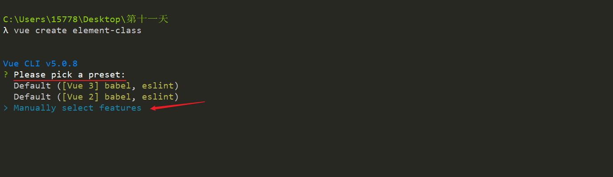


3. 安装项目中需要使用的库以及功能，分别选择以下几个模块

   - `Babel`：`es6` 转 `es5`

   - `Router`：路由，会根据选择的 Vue 安装对应的 Vue router 版本

   - `Vuex`：状态管理库，存储共享数据，会根据选择的 Vue 安装对应的 Vuex 版本，

   - `CSS Pre-processors`：`CSS`预处理器，后面会提示你选择 `less`、`sass`、`stylus` 等

   - `Linter / Formatter`：代码格式校验 **如果不需要选择任何格式规范，可以取消默认勾选 **

     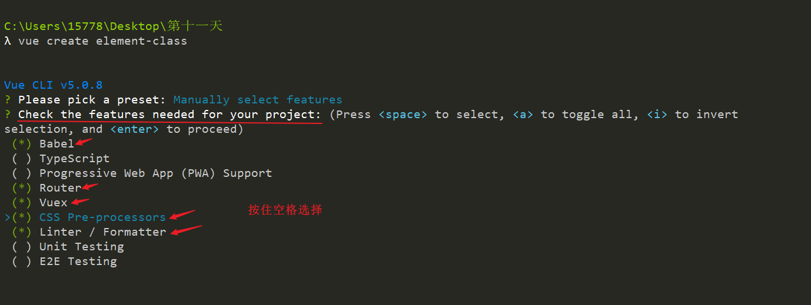

   

4. 选择 Vue 的版本

   - `2.x` ： 选择 Vue 2 的版本进行项目创建

     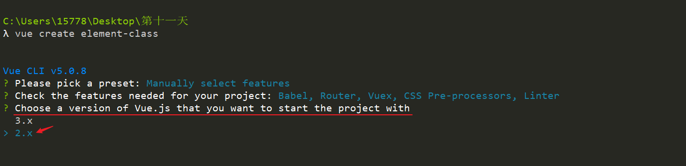

   

5. 配置路由模式

   - 是否使用 `history` 路由模式，这里输入 `n` 不使用
   - 后期我们可以根据自己更改和配置

   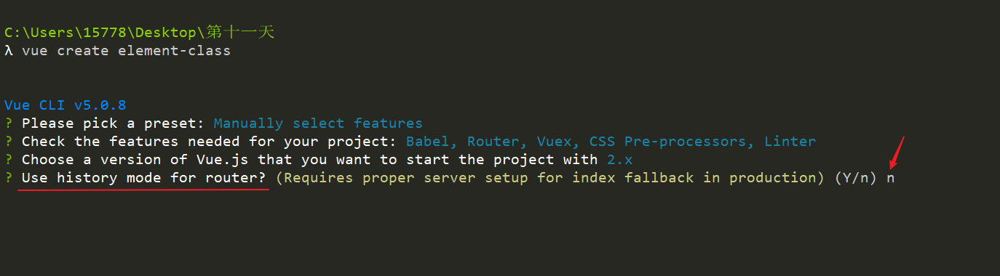

   

6. 选择 `CSS` 预处理器

   - 选择 `Less`，之前我们主要学习的 Less ，相对熟悉一点

   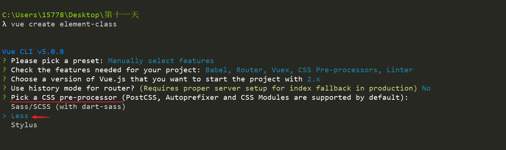

   

7. 选择代码格式规范

   - 选择 `ESLint` + [Standard config](https://standardjs.com/)
   - 如果不需要选择任何格式规范，可以在选择的时候取消掉 

   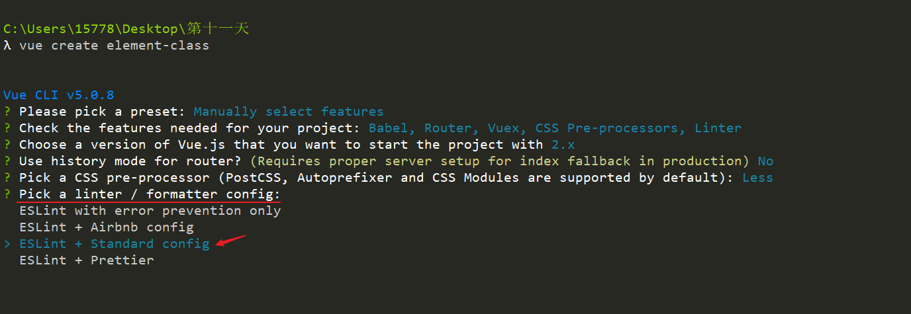

   

8. 选择在什么时机下触发代码格式校验

   - Lint on save：每当保存文件的时候
   - Lint and fix on commit：每当执行 `git commit` 提交的时候
   - **这里建议两个都选上，更严谨**

   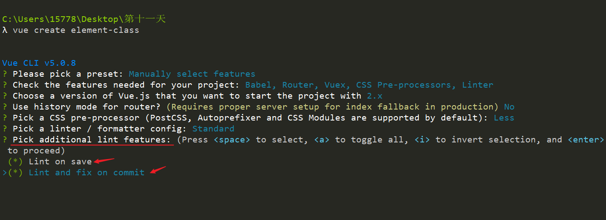


8. 额外的配置文件的配置

   - `Babel`、`ESLint` 等工具会有一些额外的配置文件，需要将这些工具相关的配置文件写到哪里
     - `In dedicated config files`：分别保存到单独的配置文件
     - `In package.json`：保存到 `package.json` 文件中
   - 里建议选择第 `1` 个，保存到单独的配置文件，这样方便我们做自定义配置

   - **这里建议两个都选上，更严谨**

   

   

9. 是否保存配置预设

   - 是否需要将刚才选择一系列配置保存起来，并可以帮我们记住上面的一系列选择，以便下次直接复用
   - 输入 `y` 或者 `n`，我这里输入 `n` ，不保存

   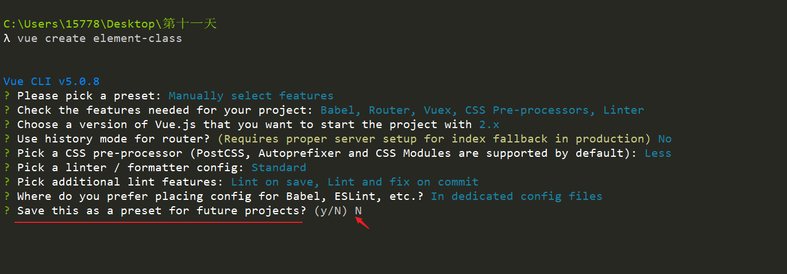

   

10. 安装向导配置结束后，开始装包，安装包的时间因为网络的原因，可能会比较长，请耐心等待~~~~

    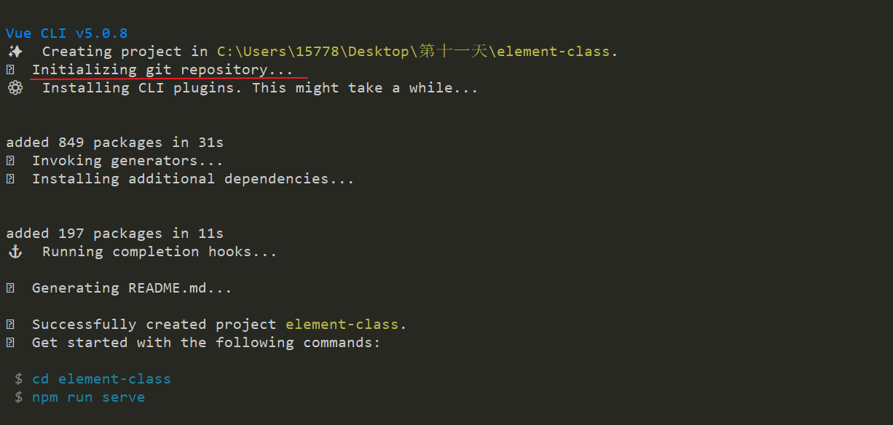


​    

11. 安装结束，命令提示你项目创建成功，按照命令行的提示在终端中分别输入

    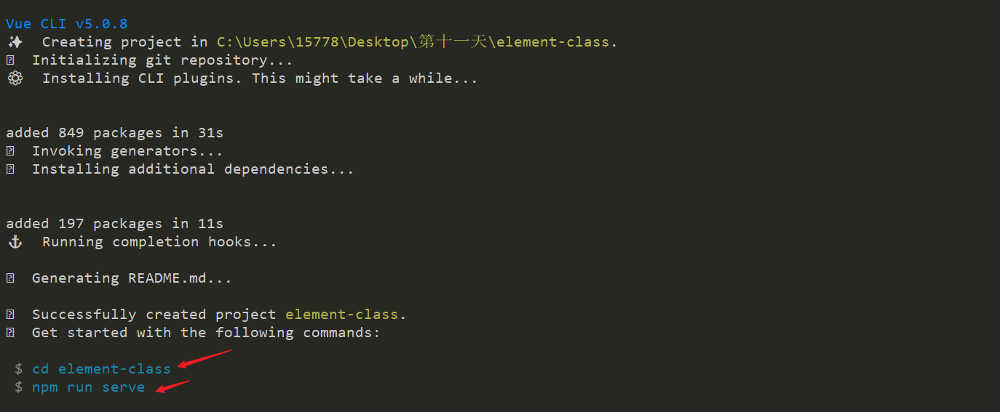

    

12. 进入你的项目目录，并启动项目

    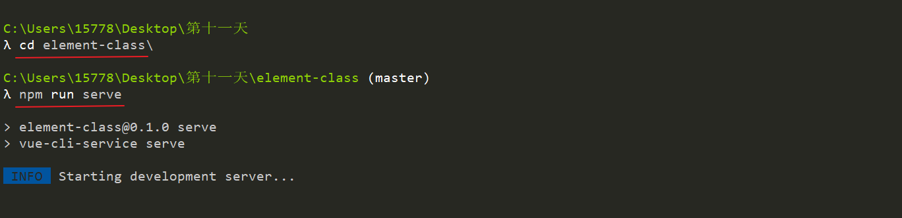


13.  项目运行成功

     - 启动成功，命令行中显示项目的运行地址

- 打开浏览器，输入其中任何一个地址进行访问

  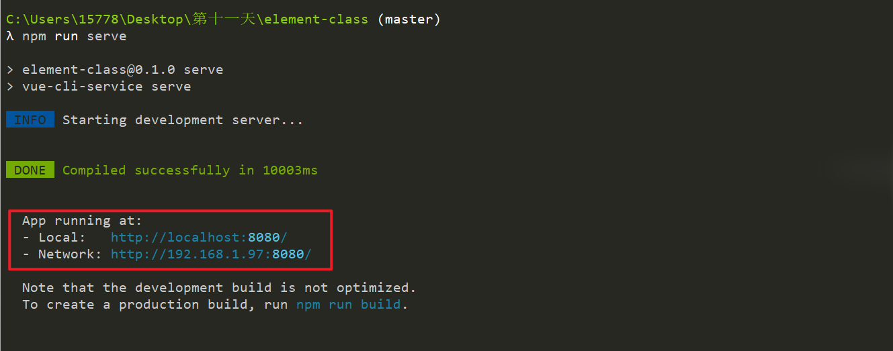

​     

14. 如果能看到该页面，表示项目创建成功了

    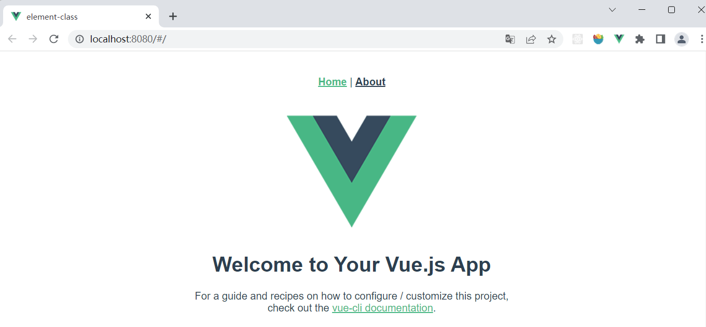


## 16. Standard 代码规范介绍(  重要 ！) ⭐


官方地址：[Standard](https://github.com/standard/standard)

中文地址：[Standard](https://github.com/standard/standard/blob/master/docs/README-zhcn.md)

详细地址：[Standard 详细规范](https://github.com/standard/standard/blob/master/docs/RULES-zhcn.md#javascript-standard-style)


**几个重要的代码准则**


- **使用两个空格** – 进行缩进

- **js 字符串使用单引号** – 需要转义的地方除外
- **不再有冗余的变量** – 这是导致 *大量* bug 的源头!
- **无分号** – [这](http://blog.izs.me/post/2353458699/an-open-letter-to-javascript-leaders-regarding)[没什么不好。](https://web.archive.org/web/20201206065632/http://inimino.org/~inimino/blog/javascript_semicolons)[不骗你！](https://www.youtube.com/watch?v=gsfbh17Ax9I)
- 行首不要以 `(`, `[`, or ``` 开头
- **关键字后加空格** `if (condition) { ... }`
- **函数名后加空格** `function name (arg) { ... }`
- 坚持使用全等 `===` 摒弃 `==` 


