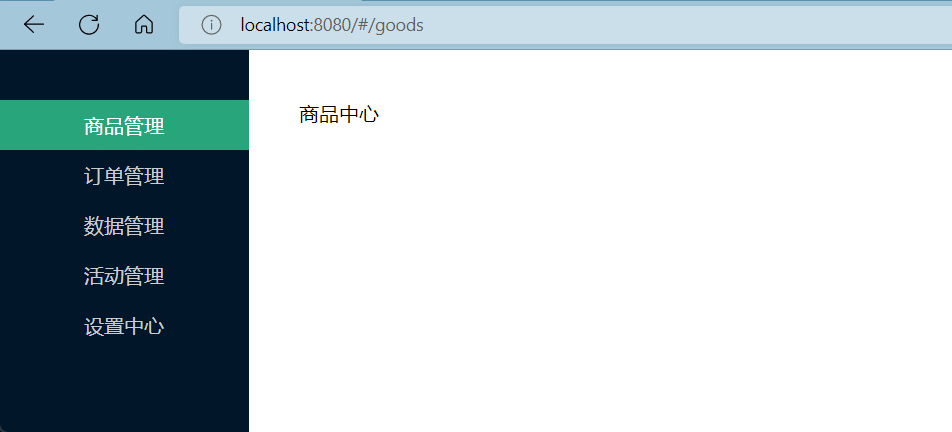

# Vue 第十天 - Vue Router


## 1. 什么是路由


Vue Router 是 [Vue.js (opens new window)](http://cn.vuejs.org/)官方的路由管理器。它和 Vue.js 的核心深度集成，


1. 什么是路由 ？ 路由就是一种对应的关系、映射的关系 

   

2. 前端路由 ？

   客户端、浏览器端路由，一个 Url 路径对应一个组件，当访问某一个 url 路径时，会将路径对应的组件呈现到页面

   

3. 什么是 SPA 单页面应用：

   一个 web 应用网站只有一个 HTML 页面，这个应用中所有组件的展示和切换都在这一个唯一的一个页面内完成，此时，不同组件之间的切换需要通过前端路由来实现！


##  2. Vue Router 案例准备


**案例效果：**




**结构准备：**

```vue
<template>
  <div id="app">
    <div class="slider">
      <a class="active" href="/goods">商品管理</a>
      <a href="/order">订单管理</a>
      <a href="/datacenter">数据管理</a>
      <a href="/active">活动管理</a>
      <a href="/setting">设置中心</a>
    </div>
    <div class="main">
      <!-- 使用 router-view 占位，展示路由对应的组件 -->
      <router-view></router-view>
    </div>
  </div>
</template>

<script>
export default {
  name: 'App'
}
</script>

<style scoped>
#app {
  height: 100%;
  display: flex;
}

.slider {
  width: 200px;
  height: 100%;
  background-color: #001529;
  padding-top: 40px;
}

.slider a {
  display: block;
  color: #ccc;
  text-align: center;
  height: 40px;
  line-height: 40px;
  text-decoration: none;
}

.slider a.active {
  background-color: #1da57a;
  color: #fff !important;
}

.active {
  background-color: #1da57a;
  color: #fff !important;
}

.main {
  margin: 40px;
}
</style>

```


##  3. Vue Router 路由的基本使用


**思路分析：**


1. 首先需要先安装 `Vue Router` ，注意：在 `Vue 2` 中，需要搭配 `Vue Router 3` 的版本
2. 在 `src` 目录下创建 `store` 目录下，创建 `index.js` 文件，初始化 `Vue Router` 实例
3. 在 `main.js` 中挂载 `router` 到 `Vue` 实例上
4. 使用 `<router-link>` 设置路由跳转链接
5. 使用 `<router-view>` 设置路由占位符，用于显示路由对应的组件信息
6. 使用 `active-class` 设置被激活时的样式


**实现步骤：**


1. 安装 Vue Router 

   ```shell
   npm install vue-router@3
   ```

   

2. 创建 Vue Router

   ```js
   import Vue from 'vue'
   import VueRouter from 'vue-router'
   
   // 导入组件
   import Goods from '@/views/Good'
   import Order from '@/views/Order'
   
   Vue.use(VueRouter)
   
   const router = new VueRouter({
     // 配置路由规则
     routes: [
       {
         path: '/goods',
         component: Goods
       },
       {
         path: '/order',
         component: Order
       }
     ]
   })
   
   export default router
   
   ```

   

3. main.js 配置路由

   ```js
   import Vue from 'vue'
   import App from './App'
   
   import router from './router'
   
   Vue.config.productionTip = false
   
   new Vue({
     render: (h) => h(App),
     router
   }).$mount('#app')
   
   ```

   

4. 在 App.vue 中进行标签和占位符设置

   ```vue
   <template>
     <div id="app">
       <div class="slider">
         <!-- 使用 router-view 设置路由跳转标签  -->
         <!-- 只要路径改变，就会被路由器检测到，从而进行规格匹配，展示对应的组件 -->
         <!-- router-link 会被解析为 a 标签，to 会被解析为 href 标签 -->
         <router-link active-class="active" to="/goods">商品管理</router-link>
         <router-link active-class="active" to="/order">订单管理</router-link>
         <router-link active-class="active" to="/datacenter">数据管理</router-link>
         <router-link active-class="active" to="/active">活动管理</router-link>
         <router-link active-class="active" to="/setting">设置中心</router-link>
       </div>
       <div class="main">
         <!-- 使用 router-view 占位，展示路由对应的组件 -->
         <router-view></router-view>
    </div>
     </div>
   </template>
   
   <script>
   export default {
     name: 'App'
   }
   </script>
   
   <style scoped>
   #app {
     height: 100%;
     display: flex;
   }
   
   .slider {
     width: 200px;
     height: 100%;
     background-color: #001529;
     padding-top: 40px;
   }
   
   .slider li {
     color: #fff;
     text-align: center;
     height: 40px;
     line-height: 40px;
   }
   
   .slider a {
     display: block;
     color: #ccc;
     text-align: center;
     height: 40px;
     line-height: 40px;
     text-decoration: none;
   }
   
   .slider a.active {
     background-color: #1da57a;
     color: #fff !important;
   }
   
   .active {
     background-color: #1da57a;
     color: #fff !important;
   }
   
   .main {
     margin: 40px;
   }
   </style>
   
   ```
   


## 4. 根路由与路由重定向


**知识点：**


当用户打开页面的时候，设置默认打开的路由的地址为 `/`

这时候通常需要给根路径设置一个路由规则，将默认的路由重定向到某个地址

```js
{
  path: '/',
  redirect: '/重定向到的地址'
}
```


##  5. 路由的几个注意事项


**知识点：**

1. 路由组件通常存放在 `pages` 文件夹，一般组件通常存放在 `components` 文件夹
2. 通过切换，将 "离开" 的路由组件进行销魂，注意：默认是被销毁掉的，需要的时候再去挂载
3. 组件实例的 "$route" 属性：存储着当前路由信息(路径、参数...... 等等)
4. 组件实例的 "$router" 属性：整个应用的路由器，后期可以通过它进行很多高级的操作


**落地代码：**


```js
<script>
export default {
  name: 'VGoods',
  mounted() {
    console.log('组件挂载完毕，我即将进入')
  },
  beforeDestroy() {
    console.log('组件即将被销毁')
  }
}
</script>
```


##  6. 嵌套路由


**实现步骤**

1. 在 `Good` 目录下新建两个组件 `AddGood/index.vue`、`GoodList/Person.vue` 组件
2. 配置路由规则，使用`children`配置子路由
3. 在 `Good/index.vue` 组件中设置跳转路由，注意：要加父级路径
4. 在`Good/index.vue`组件中预留一个`<router-view>`


**落地代码：**


`router/inde.js`

```js
const router = new VueRouter({
  // 配置路由规则
  routes: [
    {
      path: '/goods',
      component: Goods,
      redirect: '/goods/goodlist',
      children: [
        // 如果把子路由的第一个 path 设置为空
        // 当访问父路由的时候，会把 path 为空的路由设置为默认路由，直接展示
        // {
        //   path: '',
        //   component: GoodList
        // },
        {
          path: 'goodlist',
          component: GoodList
        },
        {
          path: 'addgood',
          component: AddGood
        }
      ]
    },
    {
      path: '/order',
      component: Order
    }
  ]
})
```


`AddGood/index.vue`

```vue
<template>
  <div>
    添加商品
  </div>
</template>

<script>
  export default {
    name: 'AddGood'
  }
</script>

<style scoped>

</style>
```


`GoodList/index.vue` 

```vue
<template>
  <div>
    <ul>
      <li>
        <span>商品编号</span>
        <span>商品名字</span>
        <span>商品详情</span>
      </li>
      <li v-for="item in goodsList" :key="item.id">
        <span>{{ item.id }}</span>
        <span>{{ item.name }}</span>
        <span><a href="">跳转到详情</a></span>
      </li>
    </ul>
  </div>
</template>

<script>
  export default {
    name: 'GoodList',
    data() {
      return {
        goodsList: [
          { id: 1, name: '小米手机', price: 666 },
          { id: 2, name: '华为手机', price: 777 },
          { id: 3, name: '苹果手机', price: 8888 }
        ]
      }
    },
  }
</script>

<style scoped>
ul {
  border-top: 1px solid #ccc;
  border-left: 1px solid #ccc;
}
ul li {
  list-style: none;
  height: 40px;
  line-height: 40px;
}

ul li span:first-child {
  width: 80px;
}

ul li span {
  width: 200px;
  text-align: center;
  display: inline-block;
  border-bottom: 1px solid #ccc;
  border-right: 1px solid #ccc;
}
</style>
```


`Good/index.vue`

```vue
<template>
  <div>
    <h2>商品管理</h2>
    
    <div class="good-center">
      <router-link to="/goods/goodlist">商品列表</router-link>
      <router-link to="/goods/addgood">添加商品</router-link>
    </div>

    <div>
      <router-view></router-view>
    </div>
  </div>
</template>

<script>
  export default {
    name: 'VGoods'
  }
</script>

<style scoped>
.good-center {
  margin-top: 20px;
  margin-bottom: 20px;
}

.good-center a {
  color: #666;
  margin: 20px;
}

.good-center a:hover {
  color: #222;
}

.good-center a:first-child {
  margin-left: 0px;
}
</style>
```


## 7. 路由 params 参数


### 7.1 准备详情组件


**思路分析：**

1. 准备详情组件
2. 创建路由规则
3. 在商品列表中进行跳转


**落地代码：**


1. 创建商品详情组件

2. 创建路由规则

   ```js
   {
     path: '/goods',
     component: Goods,
     redirect: '/goods/goodlist',
     children: [
       {
         path: 'goodlist',
         component: GoodList
       },
       {
         path: 'addgood',
         component: AddGood
       },
       {
         path: 'gooddetail',
         component: GoodDetail
       }
     ]
   },
   ```

   

3. 在商品列表 `GoodList/index.vue` 中进行跳转

   ```vue
   <template>
     <div>
       <ul>
         <li>
           <span>商品编号</span>
           <span>商品名字</span>
           <span>商品详情</span>
         </li>
         <li v-for="item in goodsList" :key="item.id">
           <span>{{ item.id }}</span>
           <span>{{ item.name }}</span>
           <span><router-link to="/gooddetail">跳转到详情</router-link></span>
         </li>
       </ul>
     </div>
   </template>
   
   ```


### 7.2 设置动态参数


我们经常需要把某种模式匹配到的所有路由，全都映射到同个组件，例如，我们有一个 `Detail` 组件，对于所有 id 各不相同的用户，都要使用这个组件来渲染。此时，我们可以借助 `vue-router` 提供的 "动态路径参数 " 来达到这个效果。


1. 给路由设置动态路径参数，一个“路径参数”使用冒号 `:` 标记
2. 当匹配到一个路由时，参数值会被设置到 `this.$route.params`


`router/index.js`

```js
{
  path: '/goods',
  component: Goods,
  redirect: '/goods/goodlist',
  children: [
    {
      path: 'goodlist',
      component: GoodList
    },
    {
      path: 'addgood',
      component: AddGood
    },
    {
      path: 'gooddetail/:id/:price/:name',
      component: GoodDetail
    }
  ]
},
```


 `GoodList/index.vue` 

```vue
<template>
  <div>
    <ul>
      <li>
        <span>商品编号</span>
        <span>商品名字</span>
        <span>商品详情</span>
      </li>
      <li v-for="item in goodsList" :key="item.id">
        <span>{{ item.id }}</span>
        <span>{{ item.name }}</span>
        <span>
          <router-link
             :to="`/goods/gooddetail/${item.id}/${item.price}/${item.name}`"
          >
            跳转到详情
          </router-link>
        </span>
      </li>
    </ul>
  </div>
</template>

<script>
  export default {
    name: 'GoodList',
    data() {
      return {
        goodsList: [
          { id: 1, name: '小米手机', price: 666 },
          { id: 2, name: '华为手机', price: 777 },
          { id: 3, name: '苹果手机', price: 8888 }
        ]
      }
    },
  }
</script>
```


 `GoodDetail/index.vue` 

```vue
<template>
  <div>
    <h2>商品详情</h2>
    <p>{{$route.params.id}}. 商品名字：{{$route.params.name}} 商品价格：{{$route.params.price}}</p>
  </div>
</template>

<script>
  export default {
    name: 'GoodDetail'
  }
</script>

<style scoped>

</style>
```


## 8. 路由 params 传参与命名路由


通过一个名称来标识一个路由显得更方便一些，特别是在链接一个路由，或者是执行一些跳转的时候。


1. 创建 Router 实例的时候，在 `routes` 配置中使用 name 属性给路由设置名称
2. 如果要跳转到到一个命名路由，可以给 `router-link` 的 `to` 属性传一个对象


**落地代码：**


1. 在 `routes` 配置中使用 name 属性给路由设置名称

   ```js
   const router = new VueRouter({
     // 配置路由规则
     routes: [
       {
         path: '/',
         redirect: '/goods',
         name: 'Home'
       },
       {
         path: '/goods',
         component: Goods,
         redirect: '/goods/goodlist',
         name: 'goods',
         children: [
           {
             path: 'goodlist',
             component: GoodList,
             name: 'goodlist'
           },
           {
             path: 'addgood',
             component: AddGood,
             name: 'addgood'
           },
           {
             path: 'gooddetail/:id/:price/:name',
             component: GoodDetail,
             name: 'gooddetail'
           }
         ]
       },
       {
         path: '/order',
         component: Order,
         name: 'order'
       }
     ]
   })
   ```

   

2. 要跳转到到一个命名路由，可以给 `router-link` 的 `to` 属性传一个对象

   Dashboard.vue

   ```vue
   <template>
     <div>
       <ul>
         <li>
           <span>商品编号</span>
           <span>商品名字</span>
           <span>商品详情</span>
         </li>
         <li v-for="item in goodsList" :key="item.id">
           <span>{{ item.id }}</span>
           <span>{{ item.name }}</span>
           <span>
             <!--
   			<router-link
   			   to="`/goods/gooddetail/${item.id}/${item.price}/${item.name}`"
   			>
   		      跳转到详情
      			</router-link>
   		  -->
   
             <router-link :to="{
               name: 'gooddetail',
               params: {
                 id: item.id,
                 price: item.price,
                 name: item.name
               }
             }">跳转到详情</router-link>
           </span>
         </li>
    </ul>
     </div>
   </template>
   ```
   
   

## 9. 路由 params 传参以及注意事项

1. 传递`params`参数时，必须提前占位，且要注意顺序与个数。

2. 传递`params`参数时，若使用`to`的对象写法，必须使用`name`配置项，不能用`path`。

   ```vue
   <!-- 跳转并携带params参数（to的对象写法） -->
   <router-link 
     :to="{
   	name:'gooddetail',
   	params:{
         id:item.id,
         price:item.price,
         name: item.name
       }
     }"
   >跳转</router-link>
   ```

3. 占位时，可以通过`?`可以控制`params`参数的必要性。

   ```js
   {
     //含义：id、price、name、也可不传。
     path:'detail/:id?/:price?/:name?', 
     component:Detail
   }
   ```

4. 若不想传递，有两种选择：

   - 直接不写
   - 写成`undefined`（Vue中的路由会自动忽略值为`undefined`的参数）。

   ```html
   <router-link 
     :to="{
       name:'yasse',
   	params:{
         id:m.id
       }
     }"
   >跳转</router-link>
   ```

   ```html
   <router-link 
     :to="{
       name:'yasse',
   	params:{
         id:m.id,
         price: undefined
       }
     }"
   >跳转</router-link>
   ```

   

5. `params`参数的值不要写成空字符串。


## 10. 路由 query 参数


**知识点**

如果使用 query 传参，**`不需要在路由规则位置 声明动态路径参数`**，直接写跳转的地址并携带即可 


```vue
<router-link
   :to="`/goods/gooddetail?id=${item.id}&price=${item.price}&name=${item.name}`"
>
  跳转到详情
</router-link>
```

```js
this.$route.query.xxx
```


**落地代码：**

```vue
<template>
  <div>
    <ul>
      <li>
        <span>商品编号</span>
        <span>商品名字</span>
        <span>商品详情</span>
      </li>
      <li v-for="item in goodsList" :key="item.id">
        <span>{{ item.id }}</span>
        <span>{{ item.name }}</span>
          <!--
			<router-link
			   to="`/goods/gooddetail/${item.id}/${item.price}/${item.name}`"
			>
		      跳转到详情
   			</router-link>
		  -->

          <!--
          <router-link :to="{
            name: 'gooddetail',
            params: {
              id: item.id,
              price: item.price,
              name: item.name
            }
          }">跳转到详情</router-link>
		  -->
      	<span>
          <router-link
            :to="`/goods/gooddetail?id=${item.id}&price=${item.price}&name=${item.name}`"
          >
            跳转到详情
          </router-link>
    	</span>
      </li>
    </ul>
  </div>
</template>
```


```vue
<template>
  <div>
    <h2>商品详情</h2>
    <!-- 
		<p>{{$route.params.id}}. 
		商品名字：{{$route.params.name}} 
		商品价格：{{$route.params.price}}</p>
	-->
    <p>{{$route.query.id}}. 商品名字：{{$route.query.name}} 商品价格：{{$route.query.price}}</p>
  </div>
</template>
```


## 11. 路由的 props 配置


作用：让路由组件更方便的收到参数，vue-router 允许在路由规则中开启 props 传参


> 注意：
>
> ​	如果 `props` 被设置为 `true`
>
> ​	`route.params` 将会被设置为组件属性
>
> ​    `router.query` 将不会被设置为组件属性


```js
{
	name:'gooddetail',
	path:'gooddetail/:id/:price/:name',
	component:GoodDetail,
        
  	// props的布尔值写法，作用：把收到了每一组 params 参数，作为props传给Detail组件
  	// props:true

 	// props的对象写法，作用：把对象中的每一组key-value作为props传给Detail组件
  	// props:{a:'哈哈',b:'嘻嘻',c:'拉拉'}, 
  
  	// 第三种写法：props的函数写法，作用：把返回的对象中每一组key-value作为props传给Detail组件
  	props(route){
       return route.query
  	}
}
```


**配置方式 1：**

```js
children: [
  {
    name: 'gooddetail',
    path: 'gooddetail/:id/:price/:name',
    component: GoodDetail,
    props: true
  }
]
```


**配置方式 2：**

```js
children: [
  {
    name: 'gooddetail',
    path: 'gooddetail',
    component: GoodDetail,
    props: {
      id: 1,
      price: 777,
      name: '小米手机'
    }
  }
]
```


**配置方式 3：**

```js
children: [
  {
    name: 'gooddetail',
    path: 'gooddetail',
    component: GoodDetail,
    props: () => {
      // return route.params
      return route.query
    }
  }
]
```


## 12. 缓存路由组件


作用：让不展示的路由组件保持挂载，不被销毁

需要确保缓存的是哪个组件


具体编码：

```vue
<!-- 缓存多个 -->
<keep-alive :include="['News','Message']">
   <router-view></router-view>
</keep-alive>

<!-- 缓存一个 -->
<keep-alive include="News">
   <router-view></router-view>
</keep-alive>

<!-- 缓存所有 -->
<keep-alive>
   <router-view></router-view>
</keep-alive>
```


## 13. replace 和 push 方法


  1. 作用：控制路由跳转时操作浏览器历史记录的模式。

  2. 浏览器的历史记录有两种写入方式：分别为```push```和```replace```：

     - ```push```是追加历史记录（默认值）。
     - `replace`是替换当前记录。

  3. 如何开启`replace`模式：

     ```vue
     <router-link replace .......>News</router-link>
     ```


## 14. 编程式路由导航


除了使用 `<router-link>` 创建 a 标签来定义导航链接，还可以借助 router 的实例方法，通过编写代码来实现

```js
// $router的两个API
this.$router.push({
  name:'GoodsDtail',
  params:{
    id:xxx,
    title:xxx
  }
})

// 备注：push和to属性的使用方式一样，也可以传递字符串，例如：this.$router.push('/about')
this.$router.replace({
  name:'GoodsDtail',
  params:{
    id:xxx,
    title:xxx,
    content:xxxx
  }
})


this.$router.forward() // 前进
this.$router.back() // 后退
this.$router.go() // 可前进也可后退
```


**落地代码：**

```js
goDetail(item) {
  this.$router.push(`/goods/goodsdtail?id=${item.id}&price=${item.price}`).catch(() => {})
    

  // this.$router.push(`/goods/goodsdtail/${item.id}/${item.price}`).catch(() => {})
    
  // this.$router.push({
  //   name: 'GoodsDtail',
  //   params: {
  //     id: item.id,
  //     price: item.price
  //   }
  // })

  this.$router.push({
    name: 'GoodsDtail',
    query: {
      id: item.id,
      price: item.price
    }
  })
}
```


## 16. history 与 hash 模式

1. <font color="red">history（美观，兼容性略差）—— 推荐使用</font>。

2. hash（不美观，带`#`，但兼容性较好）。

3. 如何配置？ —— 创建路由器的时候添加一个`mode`属性

   ```js
   let router = new VueRouter({
     mode:'history', //常用值：history、hash
     //....
   })
   ```

> 备注：history模式在项目部署时，需要在服务端配置路径重写，后面讲项目时，会涉及到。


## 16. 关于布局组件 Layout


 **知识点：**


`App.vue` 作为项目的根组件，一般我们不会在 `App.vue` 中进行页面的开发，这个组件只负责集成所有的组件。

即不在 `App.vue` 中进行任何页面、功能的开发，因此我们需要将公共的布局移植到一个新的组件中，这个组件一般我们称为 `Layout` 布局容器组件。


**落地代码：**

```vue
<template>
  <!-- 所有路由的出口 -->
  <router-view></router-view>
</template>
```


`Layout/index.vue`

```vue
<template>
  <div id="app">
    <div class="slider">
      <!-- 使用 router-view 设置路由跳转标签  -->
      <!-- 只要路径改变，就会被路由器检测到，从而进行规格匹配，展示对应的组件 -->
      <!-- router-link 会被解析为 a 标签，to 会被解析为 href 标签 -->
      <router-link active-class="active" to="/goods">商品管理</router-link>
      <router-link active-class="active" to="/order">订单管理</router-link>
      <router-link active-class="active" to="/datacenter">数据管理</router-link>
      <router-link active-class="active" to="/active">活动管理</router-link>
      <router-link active-class="active" to="/setting">设置中心</router-link>
    </div>
    <div class="main">
      3333
      <!-- 使用 router-view 占位，展示路由对应的组件 -->
      <router-view></router-view>
    </div>
  </div>
</template>

<script>
  export default {
    name: 'VLayout'
  }
</script>

<style scoped>
#app {
  height: 100%;
  display: flex;
}

.slider {
  width: 200px;
  height: 100%;
  background-color: #001529;
  padding-top: 40px;
}

.slider li {
  color: #fff;
  text-align: center;
  height: 40px;
  line-height: 40px;
}

.slider a {
  display: block;
  color: #ccc;
  text-align: center;
  height: 40px;
  line-height: 40px;
  text-decoration: none;
}

.slider a.active {
  background-color: #1da57a;
  color: #fff !important;
}

.active {
  background-color: #1da57a;
  color: #fff !important;
}

.main {
  margin: 40px;
}
</style>

```


```js
import Vue from 'vue'
import VueRouter from 'vue-router'

// 导入组件
import Goods from '@/views/Good'
import GoodList from '@/views/Good/GoodList'
import AddGood from '@/views/Good/AddGood'
import GoodDetail from '@/views/Good/GoodDetail'
import Order from '@/views/Order'

import VLayout from '@/views/Layout'

Vue.use(VueRouter)

const router = new VueRouter({
  // 配置路由规则
  routes: [
    {
      path: '/',
      redirect: '/goods',
      name: 'Home'
    },
    {
      path: '/goods',
      component: VLayout,
      // redirect: '/goods/goodlist',
      name: 'goods',
      children: [
        // 如果把子路由的第一个 path 设置为空
        // 当访问父路由的时候，会把 path 为空的路由设置为默认路由，直接展示
        {
          path: '',
          component: Goods,
        },
        {
          path: 'goodlist',
          component: GoodList,
          name: 'goodlist'
        },
        {
          path: 'addgood',
          component: AddGood,
          name: 'addgood'
        },
        // {
        //   path: 'gooddetail/:id/:price/:name',
        //   component: GoodDetail,
        //   name: 'gooddetail'
        // },
        {
          path: 'gooddetail/:id/:price/:name',
          component: GoodDetail,
          name: 'gooddetail',
          props (route) {
            return route.params
          }
        }
      ]
    },
    {
      path: '/order',
      component: VLayout,
      name: 'order',
      children: [
        {
          path: '',
          component: Order
        }
      ]
    }
  ]
})

export default router

```


